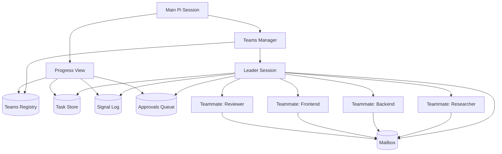
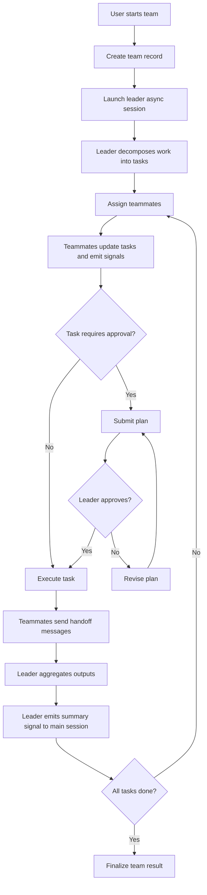
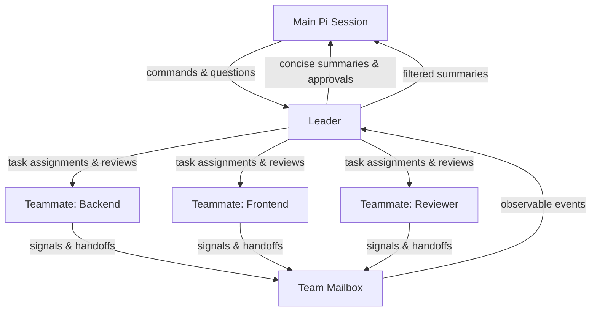
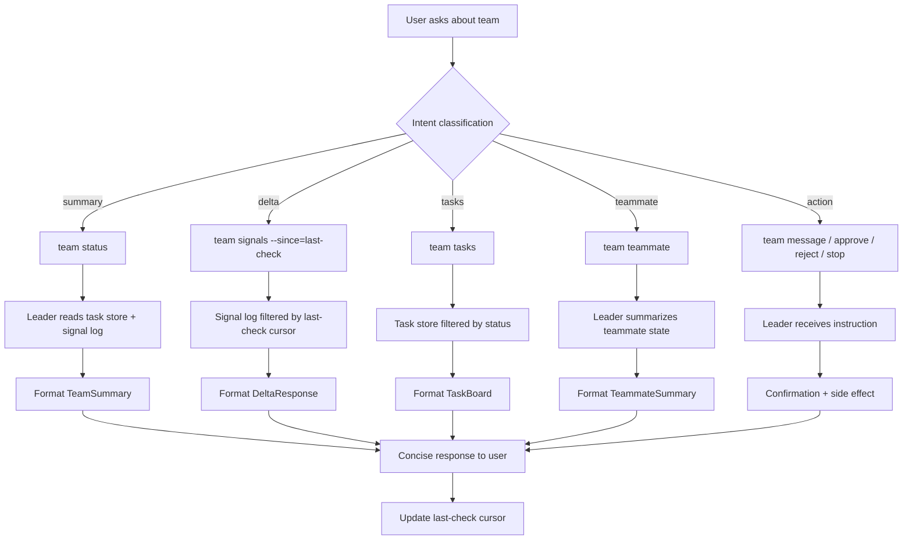

# Pi Teams Implementation Plan

## Goal

Implement **Teams** in Pi: background, leader-driven multi-agent runs that keep the main session clean while providing structured visibility into progress, task ownership, approvals, and outcomes.

## Product Summary

### User-facing concepts
- **Team**: an orchestrated multi-agent run
- **Leader**: the orchestrator session for a team
- **Teammate**: a worker agent inside the team
- **Task**: durable unit of work with status, owner, and dependencies
- **Signal**: append-only event describing progress or changes
- **Mailbox**: structured communication channel between teammates
- **Approval Gate**: optional review step before risky implementation begins

### Core promise
- The **main Pi session stays lightweight**
- The **leader absorbs context pollution**
- Users can **keep chatting while teams run in the background**
- Users can **run multiple teams concurrently**
- Progress is visible through **tasks** and **signals**

---

## Success Criteria

### MVP success criteria
1. User can start a team from the main session
2. Team runs asynchronously in the background
3. A leader spawns and manages 2–4 teammates
4. The leader maintains a task board with dependency tracking
5. Teammates can send messages to each other through a team mailbox
6. The main session can inspect team progress without loading full internal context
7. Risky tasks can require plan approval before implementation
8. Teams can be stopped, resumed, and summarized
9. Write-capable teammates can be isolated via dedicated cwd/worktree/session

### Non-goals for MVP
- Full autonomous DAG optimization
- Cross-team dependency management
- Automatic merge conflict resolution
- Rich visual Kanban UI
- Arbitrary peer-to-peer invisible messaging without event logging

---

## High-Level Architecture



---

## Execution Flow



---

## System Design

## 1. Teams Manager

### Responsibilities
- Create/list/show/stop/resume teams
- Launch leader sessions asynchronously
- Maintain top-level registry of active and completed teams
- Surface progress summaries into the main session
- Route user commands to the appropriate leader

### Required capabilities
- Async session launch
- Persistent team metadata
- Progress polling
- Subscription/watch mode
- Team-level cancellation and cleanup

### Team metadata
Suggested shape:

```yaml
id: team-2026-04-03-001
name: settings-page-fullstack
status: running
created_at: 2026-04-03T18:00:00Z
updated_at: 2026-04-03T18:10:00Z
leader_session_id: sess_abc123
objective: Build settings page and API
repo_roots:
  - /path/to/repo
teammates:
  - backend
  - frontend
  - reviewer
summary: Backend plan approved; frontend waiting on API schema
```

---

## 2. Leader Runtime

### Responsibilities
- Interpret team objective
- Decompose objective into tasks
- Spawn teammates
- Assign task ownership
- Track dependencies and blockers
- Review plans for risky tasks
- Aggregate teammate outputs
- Emit summary signals upward

### Leader design principles
- Leader owns orchestration, not all execution
- Leader can inspect all team artifacts
- Leader should summarize, not forward raw noise
- Leader should periodically compact context into task/signal state
- **Leader must not execute work directly** — it delegates, reviews, and synthesizes

### Leader tool policy

The leader must be **banned from direct execution tools** to force proper delegation.
This prevents the leader from becoming a bottleneck by doing everything itself.

Inspired by Claurst's `COORDINATOR_BANNED_TOOLS` pattern.

#### Leader allowed tools
- spawn teammate
- assign task
- send message / mailbox
- approve / reject plan
- emit signal
- summarize
- read files (for review)
- inspect team state (tasks, signals, artifacts)

#### Leader banned tools
- `bash` / shell execution
- `edit` / file mutation
- `write` / file creation
- any direct code modification tool

This forces the leader to delegate all implementation to teammates.
The leader can read and inspect, but never write.

### Leader phases

The leader should follow a structured phase model, not a flat loop.
Inspired by Claurst's coordinator prompt phases.

#### Phase 1: Research
- Understand the objective
- Identify dependencies and constraints
- Spawn researcher teammates if needed
- Collect findings before planning

#### Phase 2: Synthesis
- Analyze research outputs
- Decompose into tasks with dependencies
- Assign ownership and priority
- Identify risky tasks requiring approval

#### Phase 3: Implementation
- Assign tasks to implementation teammates
- Monitor progress via signals and task updates
- Review plans for risky tasks
- Facilitate handoffs between teammates
- Rebalance work when teammates are idle or blocked

#### Phase 4: Verification
- Assign review tasks
- Collect reviewer findings
- Request revisions if needed
- Aggregate final outputs
- Emit completion summary

The leader should not jump to Phase 3 before Phase 1 is complete.
Each phase transition should be an explicit signal.

### Leader operating loop
1. Determine current phase
2. Read current tasks, signals, and mailbox
3. Identify ready tasks and blocked tasks
4. Assign new work or request revisions
5. Review plan submissions
6. Emit summary updates
7. Evaluate phase transition criteria
8. Continue until completion or cancellation

---

## 3. Teammate Runtime

### Responsibilities
- Execute a narrow role-specific slice of work
- Maintain task-local context
- Emit task updates and signals
- Send structured handoff messages
- Produce artifacts and final outputs

### Default teammate roles
- `researcher`
- `planner`
- `backend`
- `frontend`
- `reviewer`
- `tester`
- `docs`

### Constraints
- Teammates should not own global orchestration
- Teammates should not mutate unrelated tasks
- Teammates should write results through artifacts and task updates
- **Teammates cannot spawn other teammates by default** — the spawn tool is removed from
  the teammate's tool set to prevent unbounded recursion (inspired by Claurst's `AgentTool`
  self-removal pattern)
- Teammates receive **fully self-contained prompts** — they cannot see the leader's
  conversation or other teammates' context. Every prompt must include all necessary
  information to complete the task independently

---

## 4. Task Model

Tasks are the source of truth for current team state.

### Required fields
```yaml
id: task-07
title: Define API contract for settings save
owner: backend
status: in_progress
priority: high
depends_on:
  - task-03
risk_level: medium
approval_required: true
branch: team-001-backend
worktree: /tmp/pi/team-001/backend
artifacts:
  - docs/api-contract.md
blockers: []
updated_at: 2026-04-03T18:14:00Z
```

### Task statuses
- `todo`
- `ready`
- `planning`
- `awaiting_approval`
- `in_progress`
- `blocked`
- `in_review`
- `done`
- `cancelled`

### Dependency rules
- A task can move to `ready` only when dependencies are `done`
- Blocked tasks must declare blocker reason
- Leader resolves dependency transitions

---

## 5. Signal Model

Signals are append-only events for observability.

### Required fields
```yaml
id: sig-101
team_id: team-001
source: backend
type: handoff
severity: info
task_id: task-07
timestamp: 2026-04-03T18:15:00Z
message: API contract ready for frontend
links:
  - docs/api-contract.md
```

### Signal types
- `team_started`
- `task_created`
- `task_assigned`
- `task_started`
- `progress_update`
- `handoff`
- `blocked`
- `plan_submitted`
- `approval_requested`
- `approval_granted`
- `approval_rejected`
- `task_completed`
- `team_summary`
- `team_completed`
- `error`

### Summary rule
Only a subset of signals should bubble to the main session:
- approval requests
- blockers
- milestone completions
- periodic summaries
- final completion/failure

---

## 6. Mailbox Design

Mailbox is the structured message bus used for teammate communication.

### Requirements
- Messages are durable
- Messages are scoped to team and optionally task
- Leader can inspect all messages
- Teammates can subscribe to messages addressed to them or to a shared channel

### Message shape
```yaml
id: msg-42
team_id: team-001
from: backend
to: frontend
task_id: task-07
type: contract_handoff
message: API contract is ready. Please implement client integration.
attachments:
  - docs/api-contract.md
created_at: 2026-04-03T18:16:00Z
```

### Important rule
Peer messaging should feel direct in UX, but remain event-backed for observability and replay.

---

## 7. Approval Gates

### Goal
Prevent expensive or risky execution without review.

### Approval triggers
Require a plan before implementation when any of the following is true:
- many-file change
- high-risk path touched
- cross-repo work
- ambiguous objective
- large token/runtime estimate
- destructive operation

### Approval workflow
1. Teammate marks task as `planning`
2. Teammate submits plan artifact
3. Task becomes `awaiting_approval`
4. Leader reviews and either:
   - approves
   - rejects with feedback
   - escalates to user
5. If approved, task moves to `in_progress`

### Future enhancement
Allow per-team approval policy presets:
- `strict`
- `balanced`
- `fast`

---

## 8. Isolation Model

Isolation is required for safe parallel execution.

### Levels of isolation
1. **Session isolation**
   - every leader and teammate gets independent context/session
2. **Filesystem isolation**
   - write-capable teammates get dedicated cwd or worktree
3. **Tool isolation**
   - teammates may have restricted tools or path scopes
   - leader has orchestration-only tools (no bash, edit, write)
   - teammates have implementation tools but no spawn capability
4. **Branch/output isolation**
   - each write-capable teammate produces separate diffs/artifacts
5. **Transcript isolation (sidechain tagging)**
   - all teammate activity is tagged with `is_sidechain: true` in the audit trail
   - the main conversation transcript can be replayed without teammate noise
   - sidechain activity can be expanded on demand for debugging
   - parent/child lineage is preserved: each message knows its team, teammate, and task
   - inspired by Claurst's `is_sidechain` flag in `session_storage.rs`

### MVP policy
- Read-only teams: shared repo access allowed
- Write-capable teams: dedicated worktree per teammate or per team
- Main session never directly holds teammate execution context
- All teammate transcript entries are sidechain-tagged by default

---

## 9. User Experience

## Main session UX
The main session should behave like a control plane.

### Commands / intents
- create a team
- list teams
- check team status
- inspect tasks
- inspect signals
- watch team progress
- send guidance to leader
- approve/reject plan
- stop/resume team

### Example commands
- `Start a team to build X`
- `Show progress for team-12`
- `What is backend doing in team-12?`
- `Show unresolved blockers`
- `Approve the plan for task-7`
- `Stop team-12`

### Main session response style
Keep updates compact:
- current phase
- tasks done / total
- blockers
- approvals pending
- latest milestone

## Leader UX
Leader should maintain:
- team objective
- roster
- task board
- mailbox status
- approval queue
- summaries for parent session

---

---

## 10. Chat Interaction Model

The core design principle: **talk to the leader, not to every teammate.**

The main Pi session is a control plane. It never ingests full teammate deliberation,
large code context, or every internal message. The leader absorbs that complexity
and surfaces structured summaries upward.

### Communication topology



### What the main session receives

Only:
- important signals (blockers, milestones, errors)
- periodic summaries
- approval requests
- final outputs

Never:
- full teammate chain-of-thought
- raw tool traces
- every internal message exchange

### Three interaction modes

#### A. Natural chat (default)
The user talks to the main session in natural language. Pi maps intent to structured
queries against team state.

Examples:
- "How's Team Alpha doing?"
- "Any blockers?"
- "What is backend working on?"
- "What changed since last time?"

#### B. Structured commands (power users)
Explicit commands for precise queries.

Examples:
- `team status alpha`
- `team tasks alpha`
- `team signals alpha --since=last-check`
- `team teammate alpha backend`

#### C. Watch mode (passive monitoring)
A stream of compact updates without polling.

Examples:
- "Watch Team Alpha"
- `team watch alpha`

Watch streams only: task assignments, blocker alerts, approval requests, milestone completions, and team completion.

### Five query types

#### 1. Summary query
Answers: overall progress, active work, blockers, next steps.

Trigger: "Give me a team summary" / `team status <id>`

Response shape:
```text
Team Alpha — running
Progress: 4/7 tasks done

Active
- backend: implementing API validation
- frontend: waiting on API contract
- reviewer: reviewing auth changes

Blockers
- frontend blocked by task-12 (backend contract not finalized)

Next milestone
- API contract handoff to frontend
```

#### 2. Delta query
Answers: changes since last check, recent signals only.

Trigger: "What changed?" / `team signals <id> --since=last-check`

Response shape:
```text
Since your last check (12 min ago):
- backend completed validation rules
- reviewer flagged missing permission check
- frontend still blocked on task-12
```

#### 3. Task query
Answers: current task board, dependencies, ownership.

Trigger: "Show tasks" / `team tasks <id>`

Response shape:
```text
Team Alpha Tasks

Done
✓ task-01: API research (researcher)
✓ task-02: auth pattern review (reviewer)

In progress
⚙ task-03: backend API contract (backend)
⚙ task-04: settings UI scaffold (frontend)

Blocked
⏸ task-05: frontend integration — waiting on task-03

Awaiting approval
⏳ task-06: refactor auth middleware — plan submitted
```

#### 4. Teammate query
Answers: what one teammate is doing, their last output, blockers.

Trigger: "What is frontend doing?" / `team teammate <id> <name>`

Response shape:
```text
frontend — in Team Alpha
Status: blocked
Current task: task-05 (frontend integration)
Blocker: waiting on task-03 (backend API contract)
Last output: UI scaffold committed to worktree
Worktree: /tmp/pi/team-alpha/frontend
```

#### 5. Action query
Lets the user intervene without entering the team session.

Examples:
- "Tell the leader to prioritize backend"
- "Ask reviewer to check auth first"
- "Approve the plan for task-06"
- "Stop Team Alpha"
- "Let frontend proceed with a mocked contract"

The main session forwards the instruction to the leader, who acts on it.

### Teammate drill-down through the leader

When the user asks about a specific teammate, the leader:
1. checks the teammate's current task, status, and latest signals
2. summarizes without dumping raw internal state
3. includes relevant artifacts and blockers

This feels like direct communication but preserves the leader as the summarization layer.

Examples:
- "Ask backend why task-12 is blocked"
- "Ask reviewer for findings so far"
- "Ask frontend if they can proceed with a mock"

The leader either:
- answers from existing state (fast, no teammate round-trip)
- forwards the question to the teammate and returns a summary

### Multi-team dashboard

When multiple teams are running, the main session supports:
- "List active teams"
- "Which team needs me?"
- "Show blockers across all teams"
- "Show approvals pending across all teams"
- "Which teams had updates since last check?"

Response shape:
```text
Active teams: 3

Needs attention
⚠ Team Billing-1: approval required for task-09
⚠ Team Migration-2: blocked on missing schema

Recent updates
✓ Team Search-3: milestone completed (indexing pipeline done)

No attention needed
✓ Team Settings-4: running smoothly (3/5 tasks done)
```

### "Last checked" tracking

The system remembers when the user last inspected each team.

This makes delta queries meaningful:
- "What changed?" → since last check
- "What changed in Team Alpha?" → since last check for that team
- "What changed in the last 10 minutes?" → explicit time window

### Response style rules

1. **Default to concise.** First response should be 5–10 lines max.
2. **Expand on demand.** "Expand" / "Show details" / "Show tasks" drills deeper.
3. **Never dump raw teammate logs.** Always summarize.
4. **Use consistent status icons.** ✓ done, ⚙ in progress, ⏸ blocked, ⏳ awaiting approval, ⚠ needs attention.
5. **Include artifact links when relevant.** But don't inline file contents.

---

## 11. Commands, Intents & Response Schemas

### Natural language intent mapping

The main session maps natural language to structured queries.

#### Team-level intents

| User says | Maps to | Query type |
|---|---|---|
| "Start a team to build X" | `team create` | create |
| "How is Team X doing?" | `team status <id>` | summary |
| "What changed in Team X?" | `team signals <id> --since=last-check` | delta |
| "Any blockers in Team X?" | `team signals <id> --type=blocked` | delta (filtered) |
| "What's left in Team X?" | `team tasks <id> --status=todo,ready,in_progress,blocked` | task (filtered) |
| "Summarize Team X" | `team status <id>` | summary |
| "List active teams" | `team list` | list |
| "Which team needs me?" | `team list --needs-attention` | list (filtered) |
| "Watch Team X" | `team watch <id>` | watch |

#### Task-level intents

| User says | Maps to | Query type |
|---|---|---|
| "Show tasks for Team X" | `team tasks <id>` | task |
| "What tasks are blocked?" | `team tasks <id> --status=blocked` | task (filtered) |
| "What's in review?" | `team tasks <id> --status=in_review` | task (filtered) |
| "What's ready to start?" | `team tasks <id> --status=ready` | task (filtered) |
| "Show dependencies" | `team tasks <id> --show-deps` | task (detailed) |

#### Teammate-level intents

| User says | Maps to | Query type |
|---|---|---|
| "What is backend doing?" | `team teammate <id> backend` | teammate |
| "Ask reviewer for findings" | `team ask <id> reviewer <question>` | teammate (forwarded) |
| "Show researcher's latest output" | `team teammate <id> researcher --artifacts` | teammate (artifacts) |
| "Ask frontend if they can continue" | `team ask <id> frontend <question>` | teammate (forwarded) |

#### Control-level intents

| User says | Maps to | Query type |
|---|---|---|
| "Approve the plan for task-7" | `team approve <id> task-7` | action |
| "Reject the plan" | `team reject <id> <task-id>` | action |
| "Pause Team X" | `team stop <id>` | action |
| "Resume Team X" | `team resume <id>` | action |
| "Stop Team X" | `team stop <id>` | action |
| "Tell the leader to prioritize backend" | `team message <id> <guidance>` | action |
| "Tell frontend to use a mock" | `team ask <id> frontend <instruction>` | action (forwarded) |

### CLI / API Surface

#### MVP command surface

| Command | Description | Returns |
|---|---|---|
| `team create <objective>` | Create and launch a new team | team id, roster, initial status |
| `team create --template <name> <objective>` | Create from template | team id, roster, initial status |
| `team list` | List all active and recent teams | team id, name, status, progress |
| `team list --needs-attention` | Teams with blockers or pending approvals | filtered team list |
| `team status <id>` | Summary of one team | summary response |
| `team tasks <id>` | Task board for one team | task list response |
| `team tasks <id> --status=<filter>` | Filtered task board | filtered task list |
| `team signals <id>` | Recent signals | signal list |
| `team signals <id> --since=last-check` | Signals since last inspection | filtered signal list |
| `team signals <id> --type=<filter>` | Signals by type | filtered signal list |
| `team teammate <id> <name>` | Status of one teammate | teammate response |
| `team teammate <id> <name> --artifacts` | Teammate artifacts | artifact list |
| `team ask <id> <target> <question>` | Ask leader or teammate a question | answer summary |
| `team watch <id>` | Stream compact updates | live signal stream |
| `team message <id> <guidance>` | Send guidance to the leader | confirmation |
| `team approve <id> <task-or-plan-id>` | Approve a submitted plan | confirmation + task status change |
| `team reject <id> <task-or-plan-id>` | Reject with feedback | confirmation + task status change |
| `team stop <id>` | Stop all teammates and leader | confirmation |
| `team resume <id>` | Resume a stopped team | confirmation |

#### Internal runtime APIs

```typescript
// Team lifecycle
createTeam(objective: string, config: TeamConfig): TeamRecord
launchLeader(teamId: string): LeaderSession
stopTeam(teamId: string): void
resumeTeam(teamId: string): void

// Teammates
spawnTeammate(teamId: string, role: string, config: TeammateConfig): TeammateRecord
askTeammate(teamId: string, name: string, question: string): string

// Tasks
updateTask(teamId: string, taskId: string, patch: TaskPatch): TaskRecord
getTasks(teamId: string, filter?: TaskFilter): TaskRecord[]

// Signals
emitSignal(teamId: string, signal: Signal): void
getSignals(teamId: string, filter?: SignalFilter): Signal[]
getSignalsSinceLastCheck(teamId: string): Signal[]
markChecked(teamId: string): void

// Mailbox
sendMailboxMessage(teamId: string, msg: MailboxMessage): void
getMailboxMessages(teamId: string, filter?: MailboxFilter): MailboxMessage[]

// Approvals
requestApproval(teamId: string, taskId: string, artifact: string): void
approveTask(teamId: string, taskId: string): void
rejectTask(teamId: string, taskId: string, feedback: string): void

// Summaries
summarizeTeam(teamId: string): TeamSummary
summarizeTeammate(teamId: string, name: string): TeammateSummary
```

### Response schemas

#### TeamSummary
```yaml
team_id: team-alpha
name: billing-settings
status: running
objective: Build billing settings page and API
progress:
  done: 4
  total: 7
teammates:
  - name: backend
    status: in_progress
    current_task: task-03
    summary: implementing API validation
  - name: frontend
    status: blocked
    current_task: task-05
    summary: waiting on API contract
  - name: reviewer
    status: in_progress
    current_task: task-04
    summary: reviewing auth changes
blockers:
  - task_id: task-05
    owner: frontend
    reason: depends on task-03 (backend API contract)
approvals_pending:
  - task_id: task-06
    owner: backend
    artifact: docs/auth-refactor-plan.md
next_milestone: API contract handoff to frontend
last_checked: 2026-04-03T18:30:00Z
updated_at: 2026-04-03T18:42:00Z
```

#### DeltaResponse
```yaml
team_id: team-alpha
since: 2026-04-03T18:30:00Z
signals:
  - id: sig-108
    source: backend
    type: task_completed
    message: validation rules implemented
    task_id: task-03a
    timestamp: 2026-04-03T18:35:00Z
  - id: sig-109
    source: reviewer
    type: blocked
    severity: warning
    message: missing permission check in auth middleware
    task_id: task-04
    timestamp: 2026-04-03T18:38:00Z
  - id: sig-110
    source: frontend
    type: progress_update
    message: still blocked on task-12
    task_id: task-05
    timestamp: 2026-04-03T18:40:00Z
count: 3
```

#### TaskBoard
```yaml
team_id: team-alpha
tasks:
  - id: task-01
    title: API research
    owner: researcher
    status: done
    updated_at: 2026-04-03T18:05:00Z
  - id: task-03
    title: backend API contract
    owner: backend
    status: in_progress
    depends_on: [task-01]
    priority: high
    updated_at: 2026-04-03T18:35:00Z
  - id: task-05
    title: frontend integration
    owner: frontend
    status: blocked
    depends_on: [task-03]
    blockers:
      - reason: waiting on API contract from backend
    updated_at: 2026-04-03T18:20:00Z
  - id: task-06
    title: refactor auth middleware
    owner: backend
    status: awaiting_approval
    risk_level: high
    approval_artifact: docs/auth-refactor-plan.md
    updated_at: 2026-04-03T18:38:00Z
summary:
  done: 2
  in_progress: 2
  blocked: 1
  awaiting_approval: 1
  total: 6
```

#### TeammateSummary
```yaml
team_id: team-alpha
name: frontend
role: frontend
status: blocked
current_task:
  id: task-05
  title: frontend integration
  status: blocked
  blocker: waiting on task-03 (backend API contract)
last_output: UI scaffold committed to worktree
worktree: /tmp/pi/team-alpha/frontend
artifacts:
  - src/components/Settings.tsx
  - src/hooks/useSettings.ts
signals_since_last_check: 1
updated_at: 2026-04-03T18:40:00Z
```

#### MultiTeamDashboard
```yaml
active_teams: 3
needs_attention:
  - team_id: team-billing-1
    reason: approval required for task-09
    severity: warning
  - team_id: team-migration-2
    reason: blocked on missing schema
    severity: warning
recent_updates:
  - team_id: team-search-3
    type: milestone
    message: indexing pipeline completed
no_attention_needed:
  - team_id: team-settings-4
    progress: 3/5 tasks done
    status: running
```

### Chat interaction flow diagram



### Push vs pull updates

The system supports both:

#### Pull (on-demand)
User explicitly asks for updates. This is the default.

#### Push (proactive)
The leader proactively surfaces critical signals to the main session.

Push-worthy signals:
- `approval_requested` — needs user decision
- `blocked` with severity `high` — needs intervention
- `error` — something failed
- `team_completed` — team finished

All other signals stay inside the team and are available via pull.

#### Watch mode (streaming)
A sustained pull that shows compact updates as they arrive.
The user opts in with `team watch <id>` and opts out by resuming normal chat.

Watch output style:
```text
[18:35] backend: completed task-03a (validation rules)
[18:38] reviewer: ⚠ flagged missing permission check
[18:40] frontend: still blocked on task-12
[18:42] leader: summary — 4/7 done, 1 blocker, 1 approval pending
```

---

## Persistence and Artifacts

## Runtime storage
Suggested team directory layout:

```text
.pi/
  teams/
    team-001/
      team.yaml
      tasks.yaml
      signals.ndjson
      mailbox.ndjson
      approvals.yaml
      summary.md
      memory/              # durable team knowledge
        discoveries.md
        decisions.md
        contracts.md
      leader/
        session.json
        transcript.ndjson  # sidechain-tagged
      teammates/
        backend/
          session.json
          transcript.ndjson # sidechain-tagged
          outputs/
        frontend/
          session.json
          transcript.ndjson # sidechain-tagged
          outputs/
```

### Why this matters
- resumability
- debuggability
- post-mortem analysis
- summarization without loading full model context
- sidechain replay without main-session noise

---

## Team Memory vs Live Coordination

These are two separate subsystems that solve different problems.
Inspired by Claurst's explicit separation of `team_memory_sync` from `SendMessage`.

### Live coordination
Ephemeral, session-scoped state for real-time orchestration.

- **Signals**: events that happened (append-only log)
- **Mailbox**: messages between teammates (structured, durable within session)
- **Tasks**: current work assignments and status
- **Approvals**: pending review decisions

Lifecycle: created when team starts, archived when team completes.

### Durable team memory
Persistent, repo-scoped knowledge that survives across team runs.

- **Discoveries**: things the team learned (e.g., "billing API requires X-Auth header")
- **Decisions**: choices made and why (e.g., "chose REST over GraphQL because...")
- **Contracts**: agreed interfaces (e.g., API schemas, component props)

Lifecycle: persists after team completion. Available to future teams working on the same area.

### Why this matters

Without this split:
- valuable knowledge dies when a team finishes
- future teams repeat the same research
- cross-team learning doesn't happen

With this split:
- a new team can read `memory/discoveries.md` from a prior team
- contracts established by Team A are available to Team B
- decisions are traceable across time

### Memory schema
```yaml
# .pi/teams/team-001/memory/discoveries.md
---
team_id: team-001
type: discovery
---

## Billing API Auth
- Discovered by: backend (task-07)
- Date: 2026-04-03
- The billing API requires `X-Billing-Auth` header with service token
- Token is stored in AWS Secrets Manager under `billing/api-token`

## Settings Schema
- Discovered by: researcher (task-02)
- Date: 2026-04-03
- Settings are stored as JSONB in `user_preferences` table
- Max payload size: 64KB
```

### Rules
- Teammates can write to team memory during execution
- Leader can curate and summarize team memory
- Team memory is readable by any future team scoped to the same repo
- Team memory is never injected into the main session automatically

---

## Scheduling and Coordination

## MVP scheduling strategy
- Leader builds initial task graph
- Ready tasks are assigned to available teammates
- Dependency completion unlocks downstream tasks
- Blocked tasks remain visible with blocker reason
- Leader periodically rebalances when a teammate becomes idle

## Future scheduling improvements
- workload balancing
- priority-aware queueing
- confidence-based routing
- dynamic teammate creation
- automatic task splitting

---

## Phased Delivery Plan

## Phase 0 — Foundations
**Objective:** establish core models and persistence.

### Deliverables
- team registry schema
- task schema
- signal schema
- mailbox schema
- approval schema
- runtime artifact directory layout

### Exit criteria
- Can create a team record on disk
- Can append/read task and signal state
- Can inspect state without a running team

---

## Phase 1 — Async leader and progress visibility
**Objective:** allow background orchestration with clean main-session visibility.

### Deliverables
- async team creation
- leader launch in isolated session
- top-level `team list/status/watch`
- periodic leader summaries
- stop/resume support

### Exit criteria
- User can start a background team
- User can continue chatting normally
- User can inspect status and latest signals

---

## Phase 2 — Teammates, tasks, and mailbox
**Objective:** add coordinated multi-agent execution.

### Deliverables
- teammate spawning under leader
- task creation and assignment
- dependency tracking
- mailbox/handoff mechanism
- teammate progress signals

### Exit criteria
- 2–4 teammates can work concurrently
- Task ownership and status are visible
- Teammates can hand off work without user mediation

---

## Phase 3 — Approval gates and safety controls
**Objective:** support safe execution for risky work.

### Deliverables
- task risk scoring
- plan submission artifacts
- approval queue
- leader review loop
- user escalation for high-risk tasks

### Exit criteria
- Risky tasks can be blocked pending approval
- Leader can approve/reject plans cleanly
- Main session sees only essential approval prompts

---

## Phase 4 — Worktree and tool isolation
**Objective:** make write-heavy parallel execution safe.

### Deliverables
- per-teammate cwd/worktree allocation
- path-scoped tool policies
- isolated output diffs
- cleanup and lifecycle management

### Exit criteria
- Multiple write-capable teammates can operate safely
- Collisions are minimized and inspectable

---

## Phase 5 — Templates and richer UX
**Objective:** improve usability and repeatability.

### Deliverables
- reusable team templates
- role presets
- richer progress views
- stalled-task detection
- budget/runtime display

### Exit criteria
- Users can launch common team shapes quickly
- Team progress is easier to understand at a glance

---

## Suggested MVP Team Templates

Templates define **who** is on the team (composition).

### 1. Fullstack Team
- leader
- backend
- frontend
- reviewer

Use for feature work that spans API and UI.

### 2. Research Team
- leader
- researcher
- docs
- reviewer

Use for investigations, RFCs, migration planning.

### 3. Refactor Team
- leader
- planner
- implementer
- tester
- reviewer

Use for broad internal refactors.

---

## Orchestration Playbooks

Playbooks define **how** the team works (behavior pattern).
Inspired by Claurst's bundled skills like `batch` and `simplify`.

Templates say **who**. Playbooks say **how**. They compose independently.

### 1. `batch`
Split work into N parallel workers, each with worktree isolation and self-contained prompts.
All workers execute concurrently. Leader collects and aggregates results.

Best for: independent subtasks, file-per-feature work, parallel research.

### 2. `review-swarm`
Spawn 3 specialized reviewers (security, logic, quality). Each reviews independently.
Leader synthesizes verdicts into a single review summary.

Best for: PR review, audit, compliance checks.

### 3. `incremental`
Implement in small sequential commits. Each commit is reviewed before proceeding.
Leader gates each step.

Best for: risky refactors, migrations, critical path changes.

### 4. `explore-then-implement`
Phase 1: researcher explores options.
Phase 2: leader synthesizes findings into a plan.
Phase 3: implementer executes the chosen approach.
Phase 4: reviewer verifies.

Best for: ambiguous requirements, new integrations, architecture decisions.

### 5. `contract-first`
Phase 1: backend and frontend agree on API contract.
Phase 2: both implement against the contract in parallel.
Phase 3: reviewer verifies compatibility.

Best for: fullstack feature work, API-driven development.

### Playbook schema
```yaml
name: batch
description: Parallel independent workers with worktree isolation
phases:
  - name: execute
    parallel: true
    isolation: worktree
    prompt_style: self-contained
  - name: aggregate
    actor: leader
    action: synthesize results
defaults:
  approval_policy: fast
  max_teammates: 5
```

---

## Risks and Mitigations

## Risk 1: Main session gets polluted anyway
**Mitigation:** only inject summaries, blockers, approvals, and milestones into the main session.

## Risk 2: Too much orchestration overhead
**Mitigation:** default to 3–4 teammates; use simple scheduling before advanced DAG logic.

## Risk 3: Parallel writes collide
**Mitigation:** use worktrees for write-enabled roles and explicit path ownership.

## Risk 4: Leader becomes bottleneck
**Mitigation:** permit structured peer handoffs and event-backed mailbox communication.

## Risk 5: State becomes inconsistent
**Mitigation:** treat tasks as source of truth and signals as append-only event history.

## Risk 6: Approvals slow everything down
**Mitigation:** use configurable approval policies; gate only medium/high-risk tasks.

## Risk 7: Leader does work instead of delegating
**Mitigation:** ban execution tools (bash, edit, write) from the leader's tool set.
The leader can only orchestrate, inspect, and summarize. This forces proper delegation.

## Risk 8: Unbounded teammate spawning depth
**Mitigation:** teammates cannot spawn other teammates by default. The spawn tool is
removed from the teammate's tool set. Only the leader can spawn. If recursive delegation
is needed, it must be explicitly enabled with a depth limit.

## Risk 9: Team abstraction drifts from worker primitive
**Mitigation:** the team API must be a thin composition over the full worker primitive,
never a restricted subset. Every capability available to a standalone worker (worktree
isolation, background mode, tool policies) must be expressible through the team API.
Inspired by Claurst's lesson: `AgentTool` became more capable than `TeamCreateTool`,
creating a feature gap. Pi must prevent this by design.

## Risk 10: Valuable team knowledge lost after completion
**Mitigation:** separate durable team memory from live coordination. Discoveries,
decisions, and contracts persist in `memory/` after team completion and are available
to future teams.

---

## Open Questions

1. Should teams be project-scoped or global by default?
2. Should a team own a single repo root or support multi-repo teams in MVP?
3. How should leader summaries be pushed into the main session: polling, notifications, or both?
4. Should teammate roles map to existing Pi agents, or should teams define custom ad hoc roles?
5. What is the right persistence backend for long-lived teams: flat files first or embedded DB?
6. How should cancellation behave for write-capable teammates with partial diffs?
7. How much TUI support is required in MVP versus CLI/chat commands?
8. Should the runner boundary be dependency-injected (like Claurst) or a direct API?
9. How should durable team memory be scoped: per-repo, per-project, or per-workspace?
10. Should playbooks be user-definable from day one, or ship only built-in presets in MVP?
11. Should leader phase transitions be automatic or require explicit signals?

---

## Recommended Build Order

1. Implement data model and disk layout (including memory/ directory)
2. Implement runner boundary with injection seam
3. Implement async team lifecycle and status commands
4. Implement leader runtime loop with phase model and tool restrictions
5. Implement teammate spawn with self-contained prompts and recursion guard
6. Implement task assignment and dependency tracking
7. Implement signals + mailbox + sidechain transcript tagging
8. Implement chat interaction layer (intent mapping, response formatting, last-check tracking)
9. Implement approval gates
10. Implement worktree isolation
11. Add push notifications for critical signals
12. Add watch mode
13. Add team templates and orchestration playbooks
14. Add durable team memory
15. Add richer UX

---

## MVP Definition of Done

Pi Teams MVP is complete when a user can:
- start a background **team** from the main session
- keep chatting while the team runs
- ask the leader for a **summary** and get a concise response
- ask **"what changed?"** and get only updates since last check
- inspect current **tasks** and their owners/status/dependencies
- ask about a **specific teammate** and get their status without raw logs
- send **guidance to the leader** that influences team behavior
- receive **proactive push** only for blockers, approvals, and completions
- **approve or reject plans** for risky tasks from the main session
- run at least one multi-teammate workflow safely with isolated execution
- run **multiple teams concurrently** and inspect all from a single dashboard

---

## Recommendation

Build Pi Teams around these primitives from day one:
- **Team**
- **Leader** (orchestration-only, banned from direct execution)
- **Teammate** (self-contained prompts, no spawn capability by default)
- **Task**
- **Signal**
- **Mailbox**
- **Approval Gate**
- **Isolation Boundary** (including sidechain transcript tagging)
- **Team Memory** (durable knowledge that survives team completion)
- **Orchestration Playbooks** (reusable behavior patterns, separate from team composition)
- **Runner Boundary** (injected seam between team abstraction and agent runtime)

Key architectural rules:
- The leader delegates; it never executes directly
- Teammates receive self-contained prompts; they never see leader or peer context
- Teammates cannot spawn teammates; only the leader can spawn
- The team API is a thin composition over the full worker primitive, never a restricted subset
- Live coordination (signals, mailbox, tasks) is separate from durable team memory
- All teammate activity is sidechain-tagged for clean transcript replay

This gives Pi a clean, scalable version of the Claude teammates experience while improving observability, safety, and context hygiene.
