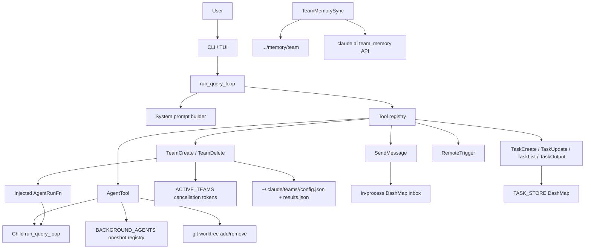
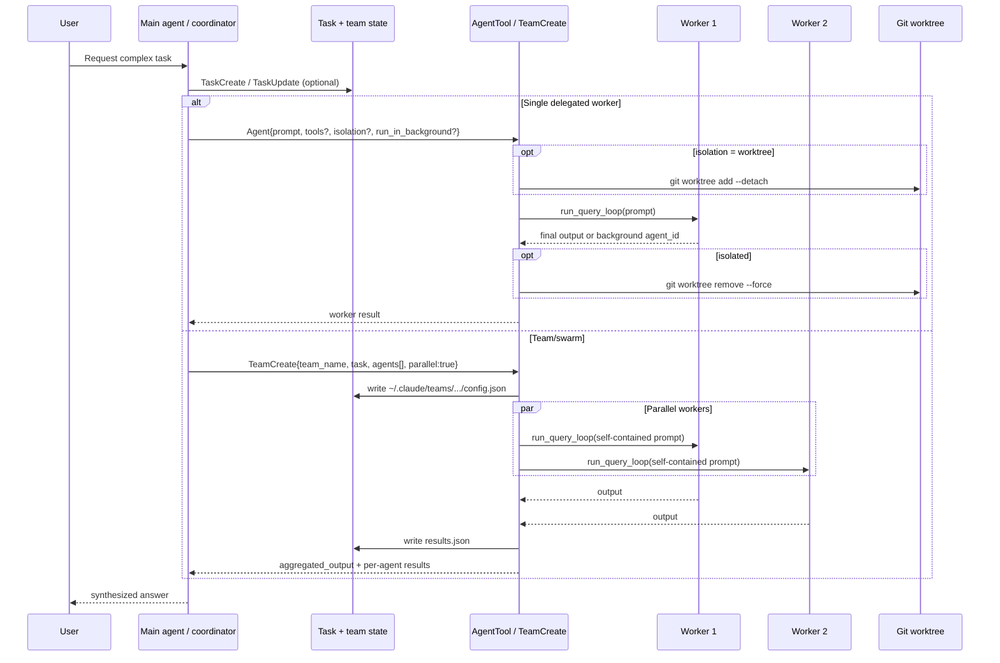

# Claurst swarm/team/multi-agent mode analysis

Analyzed repository: `https://github.com/Kuberwastaken/claurst` at commit `8f8cbfc0fcd1e713966caf7c23e0e3c994a57c26` (cloned locally for inspection).

## Executive summary

`claurst` contains **three layers of evidence** about multi-agent behavior:

1. **Actual Rust implementation** in `src-rust/`.
2. **Clean-room spec docs** in `spec/` describing the original Claude Code behavior the author was reimplementing.
3. **README commentary** summarizing the leaked upstream design.

The practical takeaway is:

- **What is concretely implemented today:** nested sub-agents via `AgentTool`, optional background agents, optional git worktree isolation, a simple team runner via `TeamCreate`/`TeamDelete`, task tracking tools, and a minimal in-process `SendMessage` inbox.
- **What is specified more richly than it is implemented:** true coordinator mode, richer swarm mailboxes, worker permission routing, cross-process teammates, detailed team UX, and durable worker-to-leader communication.

So this repo is best understood as **a useful skeleton of multi-agent orchestration plus a much richer design spec**. For pi, that is actually valuable: it shows both the runtime primitives that matter and the places where half-built swarm systems become brittle.

## Short answer: how swarm mode works here

At runtime, `claurst` uses a **tool-driven orchestration model**:

- The main agent can call `Agent` to spawn a child query loop (`src-rust/crates/query/src/agent_tool.rs`).
- The main agent can call `TeamCreate` to spawn multiple child agents, usually in parallel, via a dependency-injected runner (`src-rust/crates/tools/src/team_tool.rs`, `src-rust/crates/query/src/agent_tool.rs:init_team_swarm_runner`).
- Workers get a self-contained prompt and optional tool allowlist.
- Background agents are tracked in an in-memory registry (`BACKGROUND_AGENTS`).
- Team lifecycle is tracked in another registry (`ACTIVE_TEAMS`) plus files under `~/.claude/teams/...`.
- Communication primitives exist (`SendMessage`, `RemoteTrigger`), but the Rust port only fully implements the **send side**, not a full worker mailbox/read loop.
- The repo also defines a richer **coordinator role** and system prompt (`src-rust/crates/query/src/coordinator.rs`), but that mode is not fully wired into the main query runtime yet; `build_system_prompt()` currently sets `coordinator_mode: false` in `src-rust/crates/query/src/lib.rs`.

## Evidence map

### Runtime files that matter most

- `src-rust/crates/query/src/agent_tool.rs` — real sub-agent runtime, background mode, worktree isolation.
- `src-rust/crates/tools/src/team_tool.rs` — team creation/deletion, parallel execution, cancellation, team persistence.
- `src-rust/crates/query/src/coordinator.rs` — coordinator-mode prompt, roles, tool filtering, scratchpad gate.
- `src-rust/crates/tools/src/send_message.rs` — in-process agent messaging primitive.
- `src-rust/crates/tools/src/tasks.rs` — task model used for orchestration/status.
- `src-rust/crates/tools/src/remote_trigger.rs` — cross-session event dispatch primitive.
- `src-rust/crates/cli/src/main.rs` — registers the injected team swarm runner and adds `AgentTool` to the tool list.
- `src-rust/crates/core/src/system_prompt.rs` — generic coordinator prompt section.
- `src-rust/crates/core/src/session_storage.rs` — transcript has `is_sidechain` flag for sub-agent/sidechain messages.
- `src-rust/crates/core/src/team_memory_sync.rs` and `src-rust/crates/core/src/memdir.rs` — team-shared memory plumbing.

### Spec files worth reading alongside code

- `spec/03_tools.md` — detailed upstream semantics for `AgentTool`, `TeamCreateTool`, `TeamDeleteTool`, `SendMessageTool`.
- `spec/06_services_context_state.md` — coordinator mode, mailbox context, session mode switching.
- `spec/07_hooks.md` — worker permission forwarding, inbox pollers, swarm init hooks.
- `spec/05_components_agents_permissions_design.md` — team/swarm UI surfaces.
- `spec/12_constants_types.md` — allowed/disallowed tool sets, XML tags, in-process teammate types.

## Architecture

The architecture is split between **general-purpose sub-agents** and **team/swarm orchestration**.

### 1. `AgentTool` is the core primitive

`AgentTool` lives in `src-rust/crates/query/src/agent_tool.rs`, not in the generic tools crate, because it needs direct access to `run_query_loop()`.

That tool:

- accepts `description`, `prompt`, optional `tools`, optional `system_prompt`, optional `max_turns`, optional `model`, optional `isolation`, and `run_in_background`
- creates a dedicated `AnthropicClient`
- builds a filtered tool list for the child
- explicitly removes `AgentTool` itself unless the caller manually restricts tools, preventing unbounded recursion
- starts a nested query loop with the child prompt as the first user message

This is the right basic shape for pi too: **delegation is model-visible, but spawning is runtime-owned**.

### 2. Team/swarm is built on top of injected agent execution

`TeamCreateTool` in `src-rust/crates/tools/src/team_tool.rs` cannot directly call the query engine because of crate boundaries, so the repo uses a smart dependency-injection seam:

- `cc-tools` exposes `register_agent_runner(f)` and stores it in a process-global `OnceCell`
- `cc-query` calls `init_team_swarm_runner()` at CLI startup
- the injected closure calls `run_query_loop()` for each worker

That is a nice pattern: the generic team tool stays decoupled from the agent runtime, while still being able to spawn real workers.

### 3. Coordinator mode is a distinct role, but mostly scaffolded

`src-rust/crates/query/src/coordinator.rs` defines:

- `AgentMode::{Coordinator, Worker, Normal}`
- `COORDINATOR_ONLY_TOOLS = ["Agent", "SendMessage", "TaskStop", "TeamCreate", "TeamDelete", "SyntheticOutput"]`
- `COORDINATOR_BANNED_TOOLS = ["Bash"]`
- a detailed coordinator system prompt with phases: Research → Synthesis → Implementation → Verification
- `filter_tools_for_mode()` for hiding coordinator-only tools from workers

But the main runtime path does not appear to fully activate it yet. In `src-rust/crates/query/src/lib.rs`, `build_system_prompt()` comments that `coordinator_mode: false` is being used by default. So the design exists, but the runtime integration is incomplete.

### Architecture diagram



## Roles

The repo separates roles conceptually better than it separates them operationally.

### Coordinator / lead

The coordinator is supposed to:

- spawn workers with `Agent`
- keep direct control of `SendMessage` and `TaskStop`
- synthesize findings before delegating more work
- avoid doing direct execution itself

This is explicit in `src-rust/crates/query/src/coordinator.rs` and echoed in `src-rust/crates/core/src/system_prompt.rs`.

### Worker / teammate

Workers are supposed to:

- receive a **fully self-contained** prompt
- not depend on the parent conversation
- perform research, implementation, or verification
- return a final text result

That self-contained-worker rule is explicitly stated in `coordinator_system_prompt()`:

> "Worker prompts must be fully self-contained (workers cannot see your conversation)"

### Team members with named roles

`TeamCreateTool` lets the caller define members as:

- `name`
- optional `role`
- optional `tools`
- optional task override

It then creates per-agent system prompts like:

```text
You are agent '{name}' on team '{team}'. Your role: {role}.
Work on the assigned task thoroughly and return your complete findings.
```

That is simple but effective. It is a role prompt, not a separate runtime class.

### Plugin-defined specialist agents

A very good extensibility touch exists in `AgentTool`: when building the default sub-agent system prompt, it scans plugin agent definition markdown files from `cc_plugins::global_plugin_registry()` and appends them under `## Agent: <name>` sections.

That means the agent system can be extended without recompiling the core runtime.

## Orchestration model

### `AgentTool`: one child agent

`AgentTool` is the low-level primitive for spawning one worker.

Important properties:

- child gets its own `QueryConfig`
- child can use most tools
- child can be synchronous or backgrounded
- child can optionally run in an isolated worktree
- child returns plain final text to the parent

### `TeamCreate`: many child agents

`TeamCreateTool` wraps multiple workers under a named team.

What it does concretely:

1. validates `team_name` and `task`
2. creates `~/.claude/teams/<sanitized-team>/`
3. writes `config.json` and placeholder `results.json`
4. creates one `CancellationToken` per agent
5. spawns each worker via the injected agent runner
6. runs them with `join_all()` when `parallel: true`
7. writes final results back to disk
8. returns both structured JSON and a markdown-ish `aggregated_output`

This makes team execution auditable and externally inspectable, which is useful.

### Task tracking exists, but is only loosely integrated

`src-rust/crates/tools/src/tasks.rs` implements a global `TASK_STORE` with:

- `TaskCreate`
- `TaskGet`
- `TaskUpdate`
- `TaskList`
- `TaskStop`
- `TaskOutput`

The coordinator prompt tells the model to use `TaskCreate/TaskUpdate` for parallel work, and `/tasks` exists as a command in `src-rust/crates/commands/src/lib.rs`.

However, the integration is fairly loose:

- background `AgentTool` runs are tracked in `BACKGROUND_AGENTS`
- task tracking is in `TASK_STORE`
- there is no strong first-class mapping between the two in the Rust port

So the task layer is conceptually right, but not yet the single source of truth.

## Communication

Communication is where the gap between **design** and **current implementation** is most obvious.

### What is implemented now

`SendMessageTool` in `src-rust/crates/tools/src/send_message.rs`:

- stores messages in a global `DashMap<String, Vec<AgentMessage>>`
- supports direct send and broadcast (`to: "*"`)
- records `from`, `to`, `content`, and `timestamp`
- exposes `drain_inbox()` and `peek_inbox()` helper functions

This is a minimal in-process mailbox.

### What is missing in the Rust runtime

I could not find a full worker-side mailbox consumption loop wired into the child agent runtime.

That matters because:

- `SendMessage` can enqueue messages
- but there is no corresponding inbox-read tool or automatic delivery path in the current Rust query loop
- `TeamCreate` workers also appear to inherit the parent `ToolContext` rather than getting a distinct runtime identity in the context object

So message passing is currently more of a primitive than a complete collaboration protocol.

### What the specs say the upstream system did

The spec docs describe a much richer design:

- `spec/03_tools.md` says `SendMessage` could route to in-process agents, filesystem mailboxes, UDS sockets, or bridge sessions
- `spec/07_hooks.md` describes `useInboxPoller`, worker permission request/response handling, mode changes, shutdown messages, and plan approvals
- `spec/06_services_context_state.md` defines a mailbox React context

So the intended architecture is much richer than the Rust port currently realizes.

### Cross-session communication

`RemoteTriggerTool` in `src-rust/crates/tools/src/remote_trigger.rs` is meant for cross-session event dispatch via HTTP to `https://api.claude.ai/api/sessions/{session_id}/trigger`.

But the current Rust implementation leaves the auth token empty:

```rust
let token = String::new();
```

So as shipped here, it is more of a stub/proof of intent than a production-ready coordination channel.

## Context passing

This repo gets one big thing right: **workers should not rely on hidden parent context**.

### Self-contained worker prompts

This is repeated in multiple places:

- `src-rust/crates/query/src/coordinator.rs`
- `src-rust/crates/core/src/system_prompt.rs`
- bundled skills like `batch` and `simplify` in `src-rust/crates/tools/src/bundled_skills.rs`

The `batch` skill explicitly says:

- launch workers in a single message so they run in parallel
- use `isolation: "worktree"`
- make each worker prompt fully self-contained

That is exactly the right mental model for pi.

### Context the child actually inherits

The child query loop does inherit some runtime context from `ToolContext`:

- working directory (or isolated worktree path)
- permission handler / permission mode
- cost tracker
- config / output style
- session ID

This is practical, but there is a caveat: because the same `ToolContext` is cloned, the context inheritance is broader than the role separation suggests. That is another reason pi should make worker identity and context boundaries explicit.

### Durable shared context

The repo also has a separate concept of **team memory**:

- `src-rust/crates/core/src/memdir.rs` uses `<auto-memory>/team`
- `src-rust/crates/core/src/team_memory_sync.rs` pulls/pushes markdown files against a remote API

This is not live message passing. It is durable, repo-scoped, shared context.

That distinction is important:

- **live coordination**: mailbox / events / tasks
- **durable shared context**: team memory

## Isolation

Isolation is one of the stronger parts of the implementation.

### Git worktree isolation

`AgentTool` supports `isolation: "worktree"`.

Implementation details in `src-rust/crates/query/src/agent_tool.rs`:

- find git root by walking up to `.git`
- create a temp worktree under `/tmp/claude-agent-<uuid>`
- run `git worktree add --detach <path> HEAD`
- point the child query loop at that working directory
- call `git worktree remove --force` on completion

This is the most production-useful feature in the current swarm system, because it prevents edit collisions between parent and child or between sibling workers.

### Cancellation isolation

`TeamCreateTool` creates one `CancellationToken` per member and stores them in `ACTIVE_TEAMS`. `TeamDeleteTool` can then cancel all in-flight members and remove the team directory.

That is a clean lifecycle control mechanism.

### Transcript isolation

`src-rust/crates/core/src/session_storage.rs` includes `is_sidechain: bool` on transcript entries. That is another good pattern: sidechain/sub-agent activity should be visible to the system, but separable from the main conversation.

### Isolation gap

One important limitation: `TeamCreateTool`'s injected runner interface does **not** currently expose the richer `AgentTool` options like `isolation: "worktree"` or `run_in_background`. So the low-level `AgentTool` is more capable than the higher-level team wrapper.

## UX

### What exists in the Rust port

- `/tasks` command exists and tells the model to use `TaskList` (`src-rust/crates/commands/src/lib.rs`)
- TUI app state tracks `background_task_count` for a footer pill (`src-rust/crates/tui/src/app.rs`)
- the renderer can show `teammate:` headers (`src-rust/crates/tui/src/render.rs`)
- key prompts and skills encourage explicit parallel orchestration (`bundled_skills.rs`)

### What the specs describe beyond the current port

The spec docs describe much richer swarm UX:

- `TeamStatus.tsx` and `TeamsDialog.tsx` in `spec/05_components_agents_permissions_design.md`
- permission forwarding from workers to the leader in `spec/07_hooks.md`
- teammate view, background task navigation, inbox polling, and spawn/shutdown notifications
- keyboard flows like `ctrl+x ctrl+k` for killing agents in the TypeScript design

So the UX story in this public repo is again split:

- **runtime primitives exist now**
- **full swarm UX is mostly still in the spec layer**

## Extensibility

This is one of the more interesting parts of the design.

### Good extensibility patterns

1. **Injected agent runner**
   - lets generic team tools stay runtime-agnostic
   - avoids circular dependencies

2. **Plugin-defined agent personas**
   - `AgentTool` reads plugin markdown agent definitions and appends them to the child system prompt

3. **Skills as orchestration recipes**
   - bundled skills like `simplify` and `batch` encode reusable multi-agent playbooks
   - this is a strong pattern for pi: productize orchestration patterns as reusable prompts/workflows

4. **Team memory as a separate subsystem**
   - keeps durable context independent from worker execution

### Weak extensibility patterns

1. **Global mutable registries everywhere**
   - `BACKGROUND_AGENTS`, `ACTIVE_TEAMS`, `INBOX`, `TASK_STORE`
   - easy to build, harder to scale or distribute

2. **Communication protocol is under-specified in runtime**
   - send exists; receive/route is partial

3. **Coordinator mode not fully wired**
   - hard to extend a mode that is mostly prompt/spec today

## Flow diagram



## Important limitations and product lessons

### 1. The repo's swarm story is stronger as a design than as a finished runtime

The specs and README describe a rich coordinator/swarm platform. The Rust port implements the most important primitives, but not the full system.

### 2. The best part is worktree-backed delegation

The most concretely useful feature is `AgentTool`'s worktree isolation. That is immediately transferable.

### 3. The weakest part is messaging

A swarm system without first-class inbox consumption, typed events, and identity-aware permissions becomes fragile fast.

### 4. Team wrapper and agent primitive have drifted

`AgentTool` is richer than `TeamCreateTool`. In pi, the higher-level team abstraction should be a thin composition over the full worker primitive, not a weaker sibling path.

## What to copy into pi

### Copy directly

1. **Self-contained worker prompt discipline**
   - Claurst repeatedly insists workers cannot see the parent conversation and must receive fully self-contained prompts.
   - This is one of the most valuable design choices in the repo.

2. **Worktree isolation as a first-class worker option**
   - `AgentTool`'s `isolation: "worktree"` is the clearest production-grade concurrency primitive in the codebase.
   - Pi should keep this front-and-center for any parallel coding workflow.

3. **Dependency-injected runner boundary**
   - The `register_agent_runner()` / `init_team_swarm_runner()` split is a strong architectural pattern.
   - It keeps the team abstraction decoupled from the core query runtime.

4. **Task objects as explicit orchestration state**
   - Even though Claurst's task integration is partial, the shape is right.
   - Pi should keep explicit task IDs, status, owner, dependencies, and output, rather than hiding orchestration state inside prompts.

5. **Skills/workflows as orchestration playbooks**
   - `simplify` and `batch` are good examples of packaging multi-agent best practices into reusable workflows.
   - Pi skills/chains should do the same.

6. **Separate live coordination from durable team memory**
   - Live mailbox/events and durable `team/` memory solve different problems.
   - Pi should keep those as separate abstractions.

### Copy with changes

1. **Coordinator mode role separation**
   - Keep the idea that coordinators orchestrate and workers execute.
   - But enforce it in runtime, not just in prompt text.

2. **Named team members with roles and tool allowlists**
   - Good idea from `TeamCreateTool`.
   - In pi, also give each worker a real runtime identity, its own session/task ID, and a readable inbox.

3. **Sidechain transcript tagging**
   - `is_sidechain` is useful.
   - Pi should preserve this, but also expose parent/child lineage and artifacts more explicitly.

### Do not copy as-is

1. **Global in-memory registries as the system backbone**
   - `DashMap` globals are fine for a prototype, but not for a durable swarm platform.
   - Pi should prefer explicit session/task registries with better lifecycle ownership.

2. **Send-only messaging without first-class receive semantics**
   - Claurst's `SendMessage` primitive is not enough on its own.
   - Pi should have typed channels, read APIs, delivery guarantees, and identity-aware routing.

3. **Half-wired coordinator mode**
   - Do not ship coordinator mode as mostly prompt text plus disconnected helpers.
   - Pi should either fully wire mode-specific tool filtering, UX, and lifecycle, or keep it hidden.

## Bottom line

`claurst` is not yet a fully finished swarm runtime, but it is still very useful as research material.

Its best ideas are:

- **tool-driven delegation**
- **self-contained worker prompts**
- **git worktree isolation**
- **explicit task objects**
- **workflow/skill-based orchestration recipes**
- **a clean decoupling seam between generic team tools and the core agent runtime**

Its biggest warning signs are:

- **prompt-defined coordinator behavior without full runtime enforcement**
- **incomplete message consumption/routing**
- **global mutable registries instead of a stronger orchestration substrate**
- **feature drift between the low-level worker primitive and the high-level team wrapper**

For pi, the recommendation is: **copy the isolation, prompt discipline, and orchestration seams; do not copy the unfinished messaging/runtime split.**
