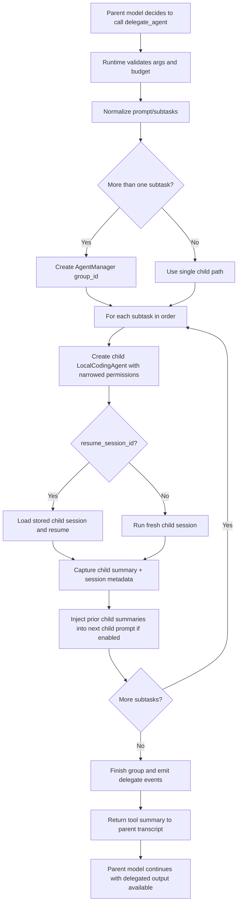

# Claw Code Agent swarm/team/multi-agent mode analysis

Analyzed repository: `https://github.com/HarnessLab/claw-code-agent` at commit `0d96076` (cloned locally for inspection).

## Executive summary

`claw-code-agent` currently has **two different layers** of “multi-agent” evidence:

1. **A real, runnable Python implementation** of nested delegation via the `delegate_agent` tool.
2. **A larger mirrored command/tool surface** that points to an upstream TypeScript architecture with richer team/swarm concepts (`agents`, `tasks`, `TeamCreateTool`, `spawnMultiAgent`, `forkSubagent`, `teamMemPrompts`, `swarmWorkerHandler`, etc.), but those features are **not implemented in the Python runtime yet**.

So the honest answer is:

- **What actually works today:** parent → delegated child agents, optional sequential subtask groups, child session resume, orchestration summaries, and budget tracking.
- **What does not fully work today:** a true swarm/team runtime with parallel workers, teammate messaging, team lifecycle commands, or dedicated team UX.

This is explicitly documented in `PARITY_CHECKLIST.md`, which says full multi-agent parity is still missing and marks `Task orchestration system`, `Team / collaboration command flows`, `Team runtime features`, and `Team messaging features` as undone.

## Short answer: how it works today

The current Python runtime implements multi-agent mode as a **tool-driven nested agent pattern**:

- The parent agent can call `delegate_agent` (`src/agent_tools.py:226`).
- The runtime intercepts that tool call and routes it to `LocalCodingAgent._execute_delegate_agent()` (`src/agent_runtime.py:1362`) instead of treating it like a normal tool.
- The runtime creates one or more child `LocalCodingAgent` instances using the same model/runtime foundation, but with:
  - narrower permissions,
  - a lower turn cap,
  - a child-specific label/index,
  - separate session IDs / scratchpad directories.
- If multiple subtasks are provided, the runtime creates a logical **group** via `AgentManager.start_group()` (`src/agent_manager.py:66`) and then executes children **sequentially**, not in parallel.
- Later child prompts can receive summaries of earlier child outputs via `_prepend_delegate_context()` (`src/agent_runtime.py:1648`).
- Results are surfaced back to the parent as:
  - a tool-result summary string,
  - structured metadata (`child_results`, `group_id`, `group_status`, etc.),
  - runtime events such as `delegate_subtask_result` and `delegate_group_result` (`src/agent_runtime.py:1689`, `src/agent_runtime.py:1705`).

That is more “delegated subagents” than a full swarm.

## Evidence map

Primary implementation files:

- `src/agent_tools.py:226` — declares the `delegate_agent` tool schema.
- `src/agent_runtime.py:1362` — actual orchestration logic in `_execute_delegate_agent()`.
- `src/agent_runtime.py:1585` — subtask normalization and max-subtask cap.
- `src/agent_runtime.py:1648` — context passing between sequential children.
- `src/agent_runtime.py:1689` / `1705` — runtime event emission for delegated subtasks/groups.
- `src/agent_manager.py:35` — parent/child/group tracking.
- `src/query_engine.py:286`, `370` — UX summary of orchestration events.
- `src/session_store.py:157`, `207` — persistence of delegated-task budgets in runtime config.
- `src/main.py:65`, `177`, `295` — CLI budget flag `--max-delegated-tasks`.

Tests proving behavior:

- `tests/test_agent_runtime.py:1318` — single delegated child.
- `tests/test_agent_runtime.py:1391` — multiple sequential subtasks with parent-context injection.
- `tests/test_agent_runtime.py:1497` — group membership tracked in `AgentManager`.
- `tests/test_agent_runtime.py:1598` — delegation into a resumed child session.
- `tests/test_agent_runtime.py:1827` — delegated-task budget enforcement.
- `tests/test_query_engine_runtime.py:947` — runtime orchestration summary includes group/child counts.
- `tests/test_query_engine_runtime.py:1038` — resumed-child summary surfaced in UX.

Mirrored upstream/team surface only:

- `src/reference_data/commands_snapshot.json:24`, `934` — mirrored `commands/agents/*` and `commands/tasks/*`.
- `src/reference_data/tools_snapshot.json:78`, `793`, `813`, `908` — mirrored `forkSubagent`, `TeamCreateTool`, `TeamDeleteTool`, `spawnMultiAgent`.
- `src/reference_data/tools_snapshot.json` also lists built-in agent roles: `exploreAgent`, `generalPurposeAgent`, `planAgent`, `verificationAgent`, `claudeCodeGuideAgent`.
- `src/reference_data/subsystems/memdir.json:13` — `memdir/teamMemPrompts.ts`.
- `src/reference_data/subsystems/hooks.json:27` — `hooks/toolPermission/handlers/swarmWorkerHandler.ts`.
- `src/reference_data/subsystems/state.json:11` — `state/teammateViewHelpers.ts`.
- `src/reference_data/subsystems/utils.json:16` — `utils/agentSwarmsEnabled.ts`.

Parity warnings:

- `PARITY_CHECKLIST.md:241` — `Task orchestration system` missing.
- `PARITY_CHECKLIST.md:243` — `Team / collaboration command flows` missing.
- `PARITY_CHECKLIST.md:319` — `Team runtime features` missing.
- `PARITY_CHECKLIST.md:320` — `Team messaging features` missing.
- `PARITY_CHECKLIST.md:78` — full multi-agent parity is still not there.

## Architecture

The current architecture is runtime-centric, not server-centric. The model chooses a delegation tool; the runtime becomes the orchestrator.

```mermaid
flowchart LR
    U[User] --> P[Parent LocalCodingAgent]
    P -->|tool call: delegate_agent| R[_execute_delegate_agent]
    R --> M[AgentManager]
    R --> S[Session Store / scratchpads]
    R --> C1[Child LocalCodingAgent #1]
    R --> C2[Child LocalCodingAgent #2]
    C1 --> T[Normal tool registry\n(read/edit/bash/etc.)]
    C2 --> T
    C1 --> E[child summary metadata]
    C2 --> E
    E --> P
    R --> Q[delegate_subtask_result / delegate_group_result events]
    Q --> X[QueryEngine / status summary]
```

### Key architectural properties

#### 1. Delegation is a tool, but execution is runtime-native

`delegate_agent` is registered in `src/agent_tools.py`, but its handler is a placeholder; the comment path makes clear it must be handled by the runtime. In the main agent loop, `src/agent_runtime.py` checks `if tool_call.name == 'delegate_agent'` and then calls `_execute_delegate_agent()`.

That split is important:

- the **LLM sees delegation as a normal tool choice**;
- the **runtime retains hard control** over spawning, permissions, grouping, budgets, and session persistence.

This is a good pattern because it keeps orchestration deterministic and auditable.

#### 2. Child agents are full agents, not lightweight function calls

Each child is a new `LocalCodingAgent` instance (`src/agent_runtime.py:1423` area) with:

- its own run/resume call,
- its own session ID,
- its own scratchpad directory,
- its own transcript and stop reason,
- its own managed-agent record.

So delegation is not just “ask the model again with a different prompt”; it is a nested runtime session.

#### 3. Grouping exists, but parallel execution does not

If there are multiple subtasks, the runtime creates a group ID via `AgentManager.start_group()` and records child membership. But the code iterates over subtasks in a plain `for index, subtask in enumerate(...)` loop inside `_execute_delegate_agent()`.

The summary string even says:

- `Delegated agent completed 2 sequential subtasks.`

So the current system is **grouped sequential delegation**, not a concurrent worker swarm.

## Roles

### What is implemented now

In the runnable Python path, roles are lightweight:

- each child can have a `label`,
- each child has `child_index`,
- each child may resume from a prior session,
- each child is otherwise the same base agent runtime.

There is **no hard role-specific prompt pack** in the current Python delegation flow.

### What the mirrored upstream surface suggests

`src/reference_data/tools_snapshot.json` points to a richer agent-role system under `tools/AgentTool/`:

- `built-in/planAgent.ts`
- `built-in/exploreAgent.ts`
- `built-in/verificationAgent.ts`
- `built-in/generalPurposeAgent.ts`
- `built-in/claudeCodeGuideAgent.ts`
- `builtInAgents.ts`
- `prompt.ts`
- `runAgent.ts`
- `resumeAgent.ts`
- `forkSubagent.ts`

That strongly suggests the upstream design includes:

- a built-in catalog of agent roles,
- role-specific prompting,
- agent start/resume/fork operations.

But in this repo, those are only mirrored references, not active Python implementations.

## Orchestration

### Parent-driven orchestration

The parent remains the coordinator. A child never independently joins a team or talks to siblings directly.

The runtime supports two shapes for `delegate_agent`:

- a single `prompt`, or
- a `subtasks` array.

`_normalize_delegate_subtasks()` (`src/agent_runtime.py:1585`) converts input into a normalized list and caps it at **8 subtasks**.

### Child creation rules

In `_execute_delegate_agent()`:

- `max_turns` is validated.
- Child permissions are derived from the parent but narrowed:
  - child write access requires both parent write permission and `allow_write=True` in tool args;
  - child shell access requires both parent shell permission and `allow_shell=True` in tool args;
  - destructive shell is always disabled for children.
- Child runtime defaults to `min(parent.max_turns, 6)` unless overridden.
- Child tools are the parent tool registry **minus `delegate_agent`**.

That last point matters: by removing `delegate_agent` from child tools, the runtime prevents unbounded recursive delegation.

### Success/failure handling

The orchestration tracks:

- `completed_children`
- `failed_children`
- `resumed_children`
- `group_status` = `completed`, `partial`, or `failed`

`continue_on_error` defaults to `True`, so a failed child usually does not stop the whole group unless the caller explicitly disables that behavior.

### Budget control

Delegation is budgeted as a first-class resource.

Evidence:

- runtime budget field `max_delegated_tasks` in `src/agent_types.py`
- CLI flag `--max-delegated-tasks` in `src/main.py`
- persisted budget config in `src/session_store.py`
- enforcement in `src/agent_runtime.py:865-872`
- test coverage in `tests/test_agent_runtime.py:1827`

This is a very good idea: multi-agent systems often need separate limits from token/tool budgets.

## Communication model

### Parent ↔ child communication

Communication is mostly **prompt-mediated** and **summary-mediated**.

The parent runtime passes information to children in three ways:

1. **Inherited runtime/system setup**
   - same model family/config unless overridden,
   - same workspace/root runtime config base,
   - same custom/append/override system prompt settings.

2. **Child prompt text**
   - direct subtask prompt,
   - optional injected prior subtask summaries.

3. **Session resume**
   - a child can continue an earlier child session via `resume_session_id`.

### Sibling communication

There is **no direct sibling messaging bus**.

Instead, later children receive a stitched summary from earlier children via `_prepend_delegate_context()`:

- it inserts a `<system-reminder>` block,
- titled `Prior delegated subtask summaries:`,
- containing up to the last 4 child output previews.

This is confirmed by `tests/test_agent_runtime.py:1391`, which asserts that the second child request contains `Prior delegated subtask summaries:`.

### Parent-facing communication

After child execution, the runtime sends a tool result back into the parent transcript containing:

- human-readable summary text,
- per-child `session_id`, `turns`, `tool_calls`, `stop_reason`, `resume_used`, `output_preview`,
- final delegated output.

It also emits machine-friendly runtime events:

- `delegate_subtask_result`
- `delegate_group_result`

That gives both transcript-level explainability and event-level observability.

## Context passing

### What gets passed

Current context passing is practical and conservative.

Passed to children:

- the child subtask prompt,
- parent-configured system prompt style,
- workspace/runtime baseline,
- optionally prior child summaries,
- optionally a resumed child transcript/history.

Not passed as a first-class structured graph:

- no shared team memory object,
- no teammate inbox/outbox,
- no direct task board object in the active runtime,
- no explicit role contract beyond label/prompt.

### Resume behavior

Resume is one of the stronger parts of this design.

`tests/test_agent_runtime.py:1598` proves a parent can:

- seed a child session,
- keep its `session_id`,
- later delegate into that existing child via `resume_session_id`,
- and the resumed child request includes earlier prompt/output context.

That makes delegation stateful across runs, not just within one parent turn.

## File and task isolation

### What is isolated well

- **Session isolation:** each run has its own session file.
- **Scratchpad isolation:** `_ensure_scratchpad_directory()` creates per-session scratchpad dirs (`src/agent_runtime.py:1722`).
- **Managed metadata isolation:** each child has its own `ManagedAgentRecord` in `AgentManager`.
- **Permission isolation:** child writes/shell are narrower than parent rights.

### What is not isolated well

- **Filesystem isolation:** children share the same `cwd`; there is no per-child worktree or sandbox.
- **Task isolation:** all children still operate against the same workspace and can affect the same files.
- **Process isolation:** there is no background worker daemon or separate long-lived team process.
- **Recursive hierarchy:** child delegation is intentionally disabled by removing `delegate_agent` from child tool registries.

So this design isolates **sessions and permissions**, but not **worktrees or file ownership**.

That is fine for simple delegation, but weaker than true swarm execution.

## UX and operator visibility

### What exists now

There is some good observability in the current runtime:

- `render_status_report()` (`src/agent_runtime.py:2055`) includes `AgentManager.summary_lines()`.
- `QueryEnginePort.render_summary()` adds sections such as `## Agent Manager`, `## Runtime Events`, and `## Runtime Orchestration` (`src/query_engine.py:286`).
- Tests confirm the summary includes lines like:
  - `- group_status:completed=1`
  - `- child_stop:stop=2`
  - `- resumed_children=1`

This is a strong debugging UX for a code-first runtime.

### What is missing

The Python runtime does **not** currently expose a dedicated team UX.

Evidence:

- slash commands in `src/agent_slash_commands.py` include `/help`, `/context`, `/prompt`, `/permissions`, `/tools`, `/memory`, `/status`, `/clear` — but no `/team`, `/agents`, or `/tasks` flow.
- CLI subcommands in `src/main.py` expose `agent`, `agent-resume`, `commands`, `tools`, etc., but no actual runnable `team` command.
- `src/commands.py` only renders mirrored command inventory from snapshots; it does not implement real `agents`/`tasks` command behavior.

So the UX is presently **developer-oriented runtime introspection**, not a polished swarm UI.

## Extensibility

This repo has a useful extensibility shape even though swarm parity is incomplete.

### 1. Tool-registry based orchestration

Because delegation is a tool declaration plus runtime interception, it is easy to:

- add new delegation arguments,
- add specialized child modes,
- add richer group policies,
- attach extra metadata/events.

### 2. Plugin-aware tool surface

`LocalCodingAgent.__post_init__()` (`src/agent_runtime.py:78`) loads a `PluginRuntime`, which can:

- register tool aliases,
- register virtual tools,
- inject pre/post behavior.

That means a future team mode could be extended through plugin-defined orchestration helpers without rewriting the base loop.

### 3. Mirrored upstream map as a roadmap

The snapshot files are not executable, but they are useful architecture clues. The mirrored paths imply likely extension seams:

- agent role catalog: `tools/AgentTool/built-in/*`
- agent lifecycle: `runAgent.ts`, `resumeAgent.ts`, `forkSubagent.ts`
- team lifecycle: `tools/TeamCreateTool/*`, `tools/TeamDeleteTool/*`
- multi-agent spawning: `tools/shared/spawnMultiAgent.ts`
- team memory: `memdir/teamMemPaths.ts`, `memdir/teamMemPrompts.ts`
- worker permissions: `hooks/toolPermission/handlers/swarmWorkerHandler.ts`
- teammate UI state: `state/teammateViewHelpers.ts`
- feature flagging: `utils/agentSwarmsEnabled.ts`

### 4. Good event model for future TUI/GUI work

The emitted events (`delegate_subtask_result`, `delegate_group_result`) are the right kind of low-level contract for building:

- a live teammate panel,
- child progress chips,
- attach/resume flows,
- orchestration dashboards.

## Current limitations

These limitations are important if you want to port the ideas into `pi`.

1. **No real parallel swarm execution** in the current Python runtime.
2. **No direct child-to-child messaging**.
3. **No per-agent worktree/filesystem isolation**.
4. **No fully implemented tasks/team command layer**.
5. **No true team memory runtime**, only mirrored references to one.
6. **No full team UI**, only summaries and status text.

In short: the repo implements a **strong delegation scaffold**, not a finished team operating system.

## Flow of a delegated group



## What to copy into pi

### 1. Copy the runtime-owned delegation pattern

The best idea here is not “swarm” branding; it is the architecture where:

- the model chooses a delegation tool,
- but the runtime, not the model, controls spawning and policy.

For `pi`, this maps well to a built-in subagent tool whose implementation lives in the harness, not in user-space prompt logic.

### 2. Copy explicit child/session metadata

`claw-code-agent` returns useful structured metadata per child:

- label
- session_id
- turns
- tool_calls
- stop_reason
- resume_used
- output_preview

`pi` should keep or expand this. It is excellent for:

- TUI rendering,
- audit logs,
- resumability,
- chain debugging.

### 3. Copy delegated-task budgets

Separate budgets for delegated work are a very good design choice. `pi` should keep a dedicated budget dimension like:

- max delegated agents,
- max delegated depth,
- max concurrent workers,
- max delegated cost/tokens.

### 4. Copy the event stream contract

The `delegate_subtask_result` and `delegate_group_result` events are exactly the sort of stable event interface `pi` can use for:

- live UI panels,
- notifications,
- telemetry,
- resumable async jobs.

### 5. Copy resumable child sessions

The ability to resume a child by session ID is more valuable than one-shot fan-out. It enables:

- iterative reviewer agents,
- long-lived planner agents,
- background or attachable workers.

This is worth bringing into `pi`.

### 6. Improve on their weakest point: isolation

Do **not** copy the shared-workspace-only approach as-is. In `pi`, prefer:

- per-agent worktrees or filesystem scopes,
- explicit file ownership or lock hints,
- conflict-aware mergeback.

That is where `pi` can be materially better.

### 7. Improve on their weakest point: structured role system

The mirrored snapshots suggest useful built-in roles (`plan`, `explore`, `verify`), but the active Python runtime does not yet implement them deeply. In `pi`, build roles as:

- explicit agent definitions,
- composable prompt templates,
- policy/tool presets,
- optional model overrides.

### 8. Keep parent-mediated communication by default

The current repo’s safest choice is that siblings do not talk directly; the parent mediates through summaries. That is a good default for `pi` too because it:

- limits context explosion,
- reduces prompt injection spread,
- keeps orchestration auditable.

If direct messaging exists, it should be opt-in.

## Bottom line

`claw-code-agent` does **not** currently implement a full team/swarm runtime in its active Python code. What it does implement is a solid, evidence-backed **delegated subagent orchestration layer** with:

- nested child agents,
- sequential grouped subtasks,
- resumable child sessions,
- per-child metadata,
- group tracking,
- budget enforcement,
- user-visible orchestration summaries.

The mirrored snapshot files show that the broader upstream design likely includes richer team/task/worker concepts, but those remain architectural hints, not active runtime behavior in this repo.

If you want to borrow from it for `pi`, copy the **runtime-controlled delegation core, event model, and resume semantics** — and then add the stronger isolation, true concurrency, and first-class role/task UX that this repo still lacks.
