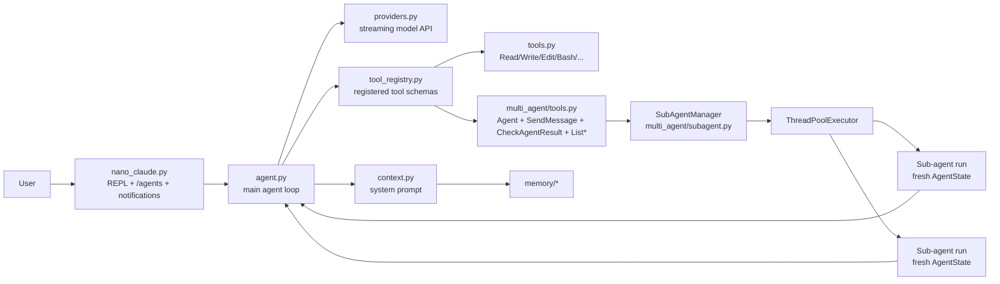
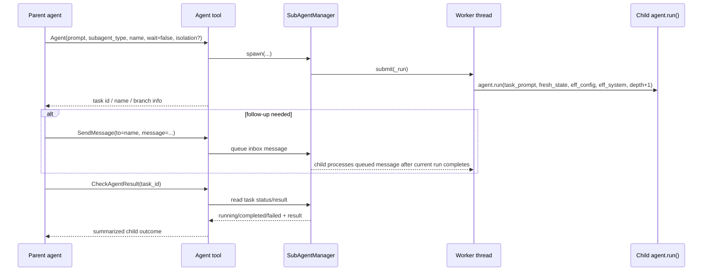

# nano-claude-code swarm / team / multi-agent report

## Executive summary

`nano-claude-code` does **not** implement a separate planner/supervisor product surface called `team` or `swarm`. The concrete implementation is a **recursive sub-agent system** exposed through tool calls and lightweight REPL UX:

- `Agent` spawns a sub-agent
- `SendMessage` sends a follow-up message to a running named agent
- `CheckAgentResult` polls status/result
- `ListAgentTasks` lists running/completed tasks
- `ListAgentTypes` lists built-in and custom agent roles

The core mechanism lives in `multi_agent/subagent.py` and `multi_agent/tools.py`, and is integrated into the main agent loop in `agent.py`, the system prompt in `context.py`, and the REPL in `nano_claude.py`.

The overall pattern is: **one agent loop can call an `Agent` tool, which starts another agent loop in a background thread, optionally inside a temporary git worktree**. That gives the model a primitive from which it can create a “swarm” by launching multiple named agents with `wait=false` and later polling or messaging them.

## Evidence base

This report is based on direct inspection of these files in the cloned repository:

- `README.md`
- `Update_README.MD`
- `docs/architecture.md`
- `agent.py`
- `context.py`
- `tools.py`
- `tool_registry.py`
- `config.py`
- `multi_agent/subagent.py`
- `multi_agent/tools.py`
- `nano_claude.py`
- `skill/executor.py`
- `tests/test_subagent.py`

## What “swarm mode” means in this repo

In this codebase, “swarm/team/multi-agent” is really **LLM-directed fan-out over a shared tool runtime** rather than a separate orchestration engine.

There is **no dedicated `/swarm` or `/team` command**. The feature is exposed as:

- “Sub-Agents” / “Multi-Agent” in `README.md`
- a `## Multi-Agent` system-prompt section in `context.py`
- the `Agent` family of registered tools in `multi_agent/tools.py`
- a `/agents` REPL command plus background notifications in `nano_claude.py`

So the “swarm” is emergent: the parent model decides when to spawn one or more workers, whether to wait, and how to combine results.

## Architecture

At a high level, the design is:

1. `nano_claude.py` runs the REPL and renders tool activity.
2. `agent.py` runs the main streaming/tool-use loop.
3. `multi_agent/tools.py` exposes multi-agent operations as tools the model can call.
4. `multi_agent/subagent.py` owns task lifecycle, thread-pool execution, role definitions, and worktree helpers.
5. spawned sub-agents call back into the **same** `agent.run(...)` loop recursively.

### Key architectural choices

### 1) Recursive reuse of the same agent loop

`multi_agent/subagent.py` defines `_agent_run(...)` as a lazy wrapper around `agent.run(...)`. That means sub-agents are not special workers with a different runtime; they are **the same agent loop**, just started in a new thread with a fresh `AgentState`.

This is the main reason the feature is small but powerful: the parent and child share the same provider abstraction, tool registry, permission model, compaction behavior, and prompt structure.

### 2) Threaded orchestration, not process orchestration

`SubAgentManager` uses `ThreadPoolExecutor`, not processes, RPC, or an event bus. The repo’s own architecture notes in `docs/architecture.md` explicitly call out “threading, not asyncio”.

Implications:

- easy to add background tasks
- shared in-memory task registry
- low implementation complexity
- but weaker isolation than process-based workers

### 3) Tools are the orchestration API

The multi-agent system is not hidden inside the CLI. It is presented to the model as ordinary tools in `multi_agent/tools.py`:

- `Agent`
- `SendMessage`
- `CheckAgentResult`
- `ListAgentTasks`
- `ListAgentTypes`

That is a good design for composability: the model can decide when to parallelize instead of relying on hardcoded orchestration rules.

## Roles

Roles are defined by `AgentDefinition` in `multi_agent/subagent.py`.

Built-in roles:

- `general-purpose`
- `coder`
- `reviewer`
- `researcher`
- `tester`

These are lightweight role profiles, not separate binaries or runtimes. Each role can contribute:

- `system_prompt` additions
- `model` override
- `tools` list
- `description`

Examples from `multi_agent/subagent.py`:

- `coder` adds a prompt about clean, idiomatic, minimal code changes
- `reviewer` adds review/security guidance and declares `tools=["Read", "Glob", "Grep"]`
- `researcher` adds evidence-focused instructions like citing file paths and line numbers

### Important nuance: roles are mostly prompt-level, not hard sandboxing

Although `AgentDefinition` has a `tools` field and `ListAgentTypes` displays it in `multi_agent/tools.py`, I did **not** find enforcement of per-agent tool allowlists in the runtime path:

- `agent.py` always calls `get_tool_schemas()` with the full registry
- `tool_registry.py` does not filter by allowed tools
- `multi_agent/subagent.py` does not apply `agent_def.tools` to the tool registry before execution

So in practice, role specialization is mainly:

- a prompt/persona change
- sometimes a model override

—not a hard capability boundary.

## Orchestration model

### Spawn

The `Agent` tool in `multi_agent/tools.py` collects:

- `prompt`
- `subagent_type`
- `name`
- `model`
- `wait`
- `isolation`

It then:

1. gets the singleton manager via `get_agent_manager()`
2. reads `_system_prompt` and `_depth` from `config` (injected by `agent.py`)
3. optionally resolves a specialized `AgentDefinition`
4. calls `SubAgentManager.spawn(...)`

### Depth control

`agent.py` injects runtime metadata into config:

- `_depth`
- `_system_prompt`

`SubAgentManager.spawn(...)` rejects new tasks when `depth >= self.max_depth`.

That prevents infinite recursive spawning.

### Sync vs async

The orchestration split is simple and useful:

- `wait=true` (default): parent blocks until sub-agent completes, then gets the final text
- `wait=false`: parent gets task metadata immediately and continues

This is what enables swarm-like patterns. The parent can launch multiple background workers, then later call `CheckAgentResult` or `SendMessage`.

### Result handling

Sub-agent results are simplified to the **last assistant text** in the child’s message history via `_extract_final_text(...)` in `multi_agent/subagent.py`.

That means the parent sees a compact final answer, not the child’s full transcript/tool trace.

## Communication and context passing

### Parent → child

Context passing is deliberately narrow:

- the child gets the parent’s `system_prompt`
- the child gets config/model state
- the child gets a **fresh** `AgentState()`
- the child gets the task prompt as its first user message

`docs/architecture.md` explicitly describes sub-agents as using **fresh context**. This is a notable design choice: child agents do **not** inherit the full chat history.

That keeps them cheaper and more focused, but it means the parent must write a sufficiently complete task prompt.

### Role prompt composition

If a `subagent_type` is used, `SubAgentManager.spawn(...)` prepends that role’s `system_prompt` to the base system prompt.

So role context is layered like:

1. role-specific instructions
2. normal global system prompt
3. child task prompt

### Child → parent

There is no shared transcript bus. The child reports back by:

- updating `task.status`
- storing `task.result`
- exposing status/result through `CheckAgentResult`
- surfacing a summary in REPL background notifications in `nano_claude.py`

### Follow-up messaging

`SendMessage` is implemented as a queue on each task (`SubAgentTask._inbox`). `SubAgentManager.send_message(...)` enqueues a message by task id or name.

But the behavior is not real-time interruption. In `multi_agent/subagent.py`, the inbox is drained **after** the current agent run finishes. So messages are effectively “next task” follow-ups, not mid-tool-call steering.

## File/task isolation

This is the most interesting part of the implementation.

### Default mode: shared workspace

Without `isolation="worktree"`, all agents share the same repository and filesystem state. Since they are threads in one process, they also share global process state.

### Worktree mode

`multi_agent/subagent.py` provides:

- `_git_root(...)`
- `_create_worktree(...)`
- `_remove_worktree(...)`

When `isolation="worktree"` is requested:

1. it finds the repo root with `git rev-parse --show-toplevel`
2. creates a temp dir and runs `git worktree add -b nano-agent-<id> <tempdir>`
3. stores `worktree_path` and `worktree_branch` on the task
4. appends a note to the child prompt explaining that it is in an isolated worktree and should commit before finishing
5. runs the agent after `os.chdir(worktree_path)`

This is conceptually strong: it gives each worker its own branch and checkout.

### Important implementation caveats

#### 1) `os.chdir(...)` is process-global

The isolation is implemented by changing the process working directory inside a thread. In Python, `os.chdir(...)` affects the whole process, not just one thread.

That means concurrent agents can interfere with each other’s cwd-sensitive tools, because several built-in tools default to `os.getcwd()` / `Path.cwd()` in `tools.py`.

So the repo presents worktree isolation, but the current implementation is **not truly thread-isolated**.

#### 2) cleanup appears unconditional

In `multi_agent/subagent.py`, the worker always calls `_remove_worktree(...)` in `finally:`. `_remove_worktree(...)` runs:

- `git worktree remove --force <path>`
- `git branch -D <branch>`

I did not find logic that preserves the worktree/branch when changes exist, despite the README/Update docs describing a review/merge-oriented branch flow. The implementation appears to clean up the worktree and delete the branch regardless.

That makes worktree mode good for temporary isolation during execution, but not yet a durable handoff mechanism.

#### 3) system prompt environment can be stale

The child inherits the parent-built `_system_prompt`; it is not rebuilt after switching into the worktree. So the system prompt’s cwd/git metadata can describe the parent workspace while the child is actually executing in the temp worktree. The prompt-level worktree note partly compensates for this.

## UX

The UX is intentionally thin but effective.

### Model-visible guidance

`context.py` includes a `## Multi-Agent` section telling the model how to use:

- `subagent_type`
- `isolation="worktree"`
- `wait=false`
- named agents for later addressing

That is important: the model is explicitly taught the orchestration primitives.

### REPL surfaces

`nano_claude.py` adds:

- `/agents` to show task ids, names, status, and branch info
- `_tool_desc(...)` formatting for `Agent`, `SendMessage`, `CheckAgentResult`, `ListAgentTypes`
- `_print_background_notifications()` which prints completed background-task summaries before the next prompt

This is a good lightweight UX pattern: background agents do not require constant polling by the human.

### Task addressing

Background agents can be named (`Agent(..., name="test-runner", wait=false)`), and `SendMessage` can address them by either name or task id.

That makes the UX feel much more like “team members” than anonymous jobs.

## Extensibility

### Good extensibility patterns

#### 1) Markdown-defined agent types

`multi_agent/subagent.py` loads custom agent definitions from markdown files with frontmatter. That is a good copyable pattern because it separates:

- orchestration engine
- role catalog
- project/user customization

#### 2) Tool-registry integration

Because multi-agent behavior is registered through `tool_registry.py`, it composes naturally with the rest of the system. New tools can be added without changing the core loop.

#### 3) Role-level model override

Each agent type can specify a different `model`, which is useful for cheaper reviewers/researchers or heavier coding agents.

### Extensibility gaps / mismatches

#### 1) config defaults are not fully wired

`config.py` defines:

- `max_agent_depth = 3`
- `max_concurrent_agents = 3`

But `multi_agent/tools.py` creates the singleton with `SubAgentManager()` and no config-derived arguments. `SubAgentManager.__init__` defaults to `max_concurrent=5, max_depth=5`.

So the runtime manager does not appear to honor the config defaults.

#### 2) agent-definition search path mismatch

`README.md` and `Update_README.MD` document custom agents under `.nano_claude/agents/`, but `multi_agent/subagent.py` looks under `.nano-claude/agents/` and `~/.nano-claude/agents/`.

That inconsistency would directly affect custom-role extensibility.

#### 3) frontmatter `name` is not authoritative

`_parse_agent_md(...)` sets the agent name from `path.stem`, not from frontmatter. So documentation that implies a frontmatter `name:` field controls the identifier is misleading.

#### 4) tool restrictions are declarative, not enforced

As noted above, both agent-role `tools` and skill `_allowed_tools` are declared, but I did not find runtime enforcement in `agent.py` / `tool_registry.py`.

## What to copy into pi

1. **Treat multi-agent as a tool primitive, not a separate mode.** Exposing `Agent`, `CheckResult`, `ListTasks`, and `SendMessage`-style operations to the main model is simpler and more flexible than hardcoding a swarm orchestrator.

2. **Use fresh-context workers by default.** `nano-claude-code`’s best idea is that sub-agents start from a fresh `AgentState()` and get only a focused task prompt plus the base system prompt. That keeps workers cheap and reduces accidental context bleed.

3. **Support typed workers via markdown role definitions.** The `AgentDefinition` pattern is good: role-specific prompt, optional model override, optional capability metadata, project/user overrides.

4. **Keep async task UX first-class.** The `/agents` command plus pre-prompt background notifications in `nano_claude.py` are worth copying. Users should be able to see named workers and completed-task summaries without manual polling.

5. **Keep named workers.** `name=` is a small feature with big UX value. It turns “job ids” into reusable collaborators.

6. **Copy the recursive loop design, but not the thread/cwd implementation.** Reusing the same agent loop for sub-agents is elegant. But pi should avoid thread-local fake isolation based on `os.chdir(...)`. Prefer:
   - separate processes/sessions/worktrees
   - explicit cwd per worker
   - durable artifacts/diffs per worker

7. **Make isolation durable.** If pi adopts worktree isolation, it should preserve worker branches/patches/artifacts by default and only clean them up explicitly, not implicitly.

8. **Enforce capability boundaries if you expose them.** If pi defines worker tool allowlists or agent-type tool restrictions, enforce them in the schema and dispatch path; otherwise they are just hints.

9. **Wire orchestration limits from config into the actual manager.** `max_depth` and concurrency should be real runtime controls, not only documented defaults.

## Bottom line

`nano-claude-code` implements multi-agent mode as a **recursive, tool-driven, thread-backed sub-agent manager**. Its strengths are simplicity, composability, named background workers, markdown-defined roles, and an easy UX for fan-out/poll/follow-up workflows.

Its main limitations are also clear from the code:

- no explicit planner/supervisor layer
- role/tool restrictions are mostly advisory
- worktree isolation is conceptually strong but operationally fragile because it relies on thread-shared process state
- cleanup behavior appears more destructive/ephemeral than the docs suggest

So the repo is a strong reference for **how to expose swarm primitives**, but not yet a production-grade reference for **safe worker isolation**.
