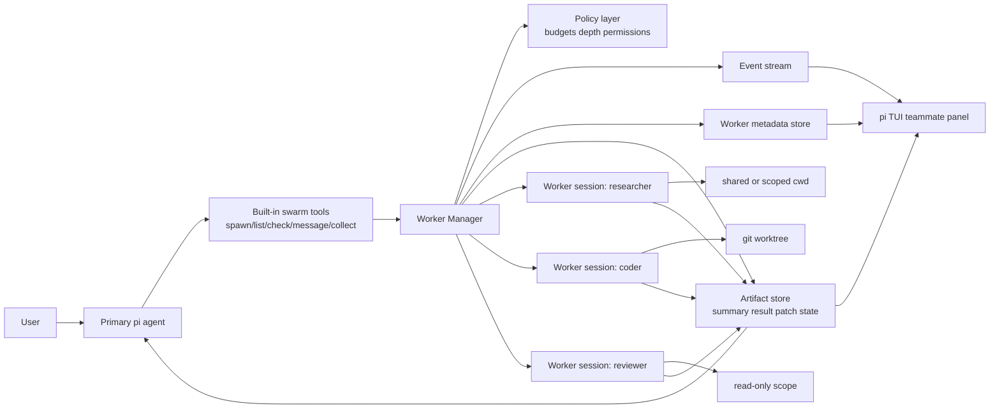
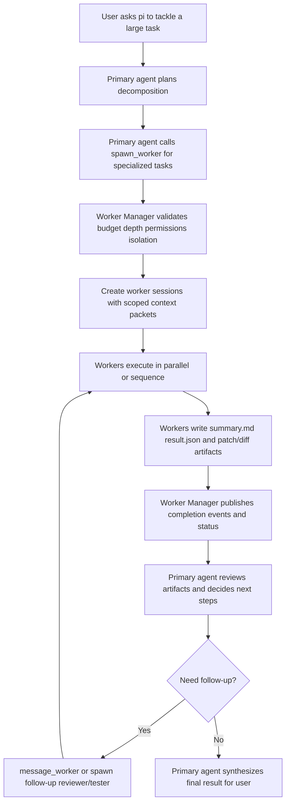

# Swarm mode synthesis for pi

## Scope

This synthesis compares these analyzed resources:

1. `SafeRL-Lab/nano-claude-code`
2. `HarnessLab/claw-code-agent`
3. `Kuberwastaken/claurst` — Rust reimplementation of Claude Code with partial swarm/team runtime

Per-resource reports used as inputs:

- `docs/nano-claude-code-swarm-report.md`
- `docs/claw-code-agent-swarm-report.md`
- `docs/claurst-swarm-report.md`

## Executive summary

The four systems converge on one core idea: **multi-agent mode works best when the main agent can delegate bounded work to specialized workers and then re-integrate durable outputs**.

But they make different tradeoffs:

- **`nano-claude-code`** is the most direct reference for a **tool-driven subagent runtime**. It exposes worker spawning, polling, and follow-up messaging as first-class tools (`multi_agent/tools.py`, `multi_agent/subagent.py`). Its strengths are simplicity and a good mental model. Its weakness is weak operational isolation.
- **`claw-code-agent`** is the best reference for **runtime-controlled delegation, eventing, resumability, and budget enforcement**. Its active Python implementation is not a full swarm yet, but it has strong child-session lifecycle patterns (`src/agent_runtime.py`, `src/agent_manager.py`, `src/session_store.py`).
- **`claurst`** is the best reference for **worktree-backed isolation, self-contained worker prompts, and dependency-injected runner boundaries**. Its Rust implementation (`src-rust/crates/query/src/agent_tool.rs`, `src-rust/crates/tools/src/team_tool.rs`) shows concrete git worktree isolation for parallel workers and a clean decoupling seam between team tools and the query runtime. Its weakness: messaging is send-only, coordinator mode is mostly scaffolded in prompts rather than enforced in runtime, and global in-memory registries don't scale.

For `pi`, the strongest path is a hybrid:

- take **tool-native subagent spawning** from `nano-claude-code`
- take **runtime ownership, budgets, events, and resumable child sessions** from `claw-code-agent`
- take **worktree isolation, self-contained prompts, and injected runner boundaries** from `claurst`
- add **real worker isolation** as a first-class concern from day one

## Approaches in detail

### 1. nano-claude-code: best reference for the subagent control surface

Concrete modules called out in the report:

- `multi_agent/subagent.py`
- `multi_agent/tools.py`
- `agent.py`
- `context.py`
- `nano_claude.py`
- `tool_registry.py`
- `config.py`

What it gets right:

- Multi-agent is exposed as an **ordinary tool surface**, not hidden inside a special mode.
- Parent/child behavior is intuitive:
  - spawn worker
  - optionally return immediately
  - poll for status/result
  - send follow-up messages
- Workers can be **named**, which is a surprisingly important UX win.
- The parent model is explicitly taught how to use the primitives in `context.py`.
- Agent types are externally defined enough to make specialization easy.

What it gets wrong or leaves soft:

- Tool restrictions appear mostly advisory rather than enforced.
- Isolation is conceptually strong but practically fragile because worktree execution uses thread-shared process state.
- Worktree cleanup appears more ephemeral/destructive than ideal for reviewable handoff.
- Runtime config limits do not appear cleanly wired into the actual subagent manager.

What this means for `pi`:

- Copy the **API shape**.
- Do not copy the **thread/cwd implementation details**.

### 2. claw-code-agent: best reference for controlled delegation and resumability

Concrete modules called out in the report:

- `src/agent_tools.py`
- `src/agent_runtime.py`
- `src/agent_manager.py`
- `src/query_engine.py`
- `src/session_store.py`
- `src/main.py`
- `PARITY_CHECKLIST.md`

What it gets right:

- Delegation is model-selectable but **runtime-owned**.
- The runtime creates real child sessions with separate IDs and scratchpad paths.
- Child permissions are narrowed relative to the parent.
- Delegation has its own budget dimensions (`--max-delegated-tasks`, stored config, enforcement).
- Structured orchestration events make the system observable.
- Resuming a child session later is built into the design.

What it lacks in the active implementation:

- No full concurrent team/swarm runtime in Python yet.
- No real teammate UX like dedicated `/team` flows.
- No direct sibling messaging.
- No per-agent worktree isolation.

What this means for `pi`:

- Copy the **policy layer**: runtime-enforced limits, child metadata, eventing, resume.
- Treat its current implementation as **foundational infrastructure**, not as the whole swarm UX.

## Reusable design patterns for pi

These are the strongest patterns that appear across the three systems.

### 1. Delegation should be model-invocable but runtime-governed

Seen in:

- `nano-claude-code`: `Agent` tool family
- `claw-code-agent`: `delegate_agent` tool intercepted in runtime

Pattern:

- Let the main agent decide when delegation helps.
- But let the harness own:
  - spawn policy
  - concurrency limits
  - depth limits
  - permissions
  - isolation
  - lifecycle tracking

This gives `pi` flexibility without surrendering control to prompt-only orchestration.

### 2. Fresh worker context by default, durable artifacts for long-lived state

Seen in:

- `nano-claude-code`: fresh `AgentState()` children
- `claw-code-agent`: child prompts with optional stitched summaries or resumed sessions

Pattern for `pi`:

- workers start with minimal context
- the orchestrator gives them a focused task packet
- durable outputs, not chat history, become the main handoff medium

This avoids context explosion and makes swarms debuggable.

### 3. Manager/worker role separation

Seen most strongly in:

- `delegate_agent` / child-runtime split (`claw-code-agent`)
- named async workers (`nano-claude-code`)

Pattern for `pi`:

- supervisor agents should plan, assign, validate, merge, and re-route
- worker agents should execute bounded tasks
- reviewers/verifiers should be distinct worker presets

This leads naturally to a Claude-teammates-like experience.

### 4. Named workers plus explicit task records

Seen in:

- `nano-claude-code`: named agents + `/agents`
- `claw-code-agent`: group IDs, child metadata, status summaries

Pattern for `pi`:

Every spawned worker should have:

- stable id
- human-readable name
- role/preset
- parent id
- status
- cwd/worktree info
- assigned files or scope
- result summary
- artifacts/diff

### 5. Event stream + artifact log

Seen in:

- `claw-code-agent`: orchestration events
- `nano-claude-code`: background completion notifications

Pattern for `pi`:

Have both:

- live event stream for UI/TUI
- durable on-disk metadata for resume/audit/debugging

### 6. Explicit budgets and safety policies

Seen most clearly in:

- `claw-code-agent`: delegated-task budgeting and child permission narrowing
- `nano-claude-code`: max-depth intent, though imperfectly wired

Pattern for `pi`:

Support separate limits for:

- max swarm depth
- max concurrent workers
- max delegated tasks
- max per-worker tool classes
- max cost/tokens/time

### 7. Role presets should be real, not cosmetic

Seen as a gap in:

- `nano-claude-code`: role tool allowlists appear advisory
- `claw-code-agent`: mirrored built-in roles exist conceptually but are not deeply active in Python runtime yet

Pattern for `pi`:

A worker preset should include enforceable:

- prompt template
- tool policy
- model choice
- output schema
- isolation default

### 8. Hard file/task isolation matters

This is where all three are incomplete in different ways.

- `nano-claude-code`: optional worktree but fragile implementation
- `claw-code-agent`: shared workspace

Pattern for `pi`:

- default to per-worker explicit cwd or worktree
- attach files/dirs/task scopes to workers
- merge back through patches/commits/artifacts, not silent shared edits

## Recommended MVP architecture for pi

The goal is a **Claude-teammates-like experience** without overbuilding.

### MVP principles

1. One orchestrator, many bounded workers.
2. Workers are invoked through a built-in tool/API.
3. Every worker has explicit scope and durable output.
4. The runtime owns limits, lifecycle, and isolation.
5. UI/TUI shows workers as teammates, not opaque jobs.

### MVP components

#### A. Built-in swarm primitives

Expose built-in orchestration operations to the main agent:

- `spawn_worker(task, role, files?, cwd?, isolation?, model?, async?)`
- `list_workers()`
- `check_worker(id)`
- `message_worker(id, message)` or `rerun_worker(id, delta)`
- `collect_results(ids?)`

This copies the strength of `nano-claude-code` while keeping implementation in `pi` runtime.

#### B. Runtime worker manager

A harness-owned service/session manager that:

- creates worker sessions
- enforces tool policies
- enforces budget/depth/concurrency limits
- stores metadata and state
- publishes events
- tracks artifacts and diffs

This is the part to borrow from `claw-code-agent`.

#### C. Artifact contract

Each worker should emit structured artifacts, for example:

- `summary.md`
- `result.json`
- `patch.diff` or commit ref
- optional `notes.md`

For larger orchestrations, also support:

- `workflow_state.yml`
- `manifest.yml`

#### D. Worker presets

Start with a small catalog:

- `general`
- `researcher`
- `planner`
- `coder`
- `reviewer`
- `tester`

Each preset defines:

- prompt scaffold
- allowed tools
- default model
- expected output format
- preferred isolation mode

#### E. Isolation modes

MVP should support at least:

- `shared` - only for read-heavy or low-risk work
- `session-cwd` - explicit working directory / file scope
- `worktree` - separate git worktree for write-heavy workers

Critically: isolation must be implemented through **real worker session boundaries**, not shared-thread cwd mutation.

#### F. TUI/UX

Provide a teammate panel with:

- worker name / role / status
- current task
- cwd/worktree
- changed files
- result summary
- attach/resume/open-diff actions

This is where `nano-claude-code`'s named workers and notifications become a full `pi` experience.

## Proposed MVP architecture diagram

## Proposed MVP flow diagram

## MVP behavior recommendations

### Default orchestration behavior

- Use delegation only when the task is clearly decomposable.
- Prefer 2-4 workers max in MVP.
- Default workers to fresh context with explicit task packets.
- Require write-capable workers to return artifacts, not just text.
- Prefer parent-mediated communication; direct worker-to-worker chat can wait.

### Default context packet

Each worker should receive:

- worker id / role
- objective
- scope boundaries
- relevant files/paths
- required outputs
- success criteria
- constraints
- parent summary/context snippet

## Next-step enhancements after MVP

### 1. Phase/DAG orchestration

- allow a planner to produce `manifest.yml`
- schedule execution batches by dependency
- bundle small related phases
- persist workflow state for long-running efforts

### 2. Resumable long-lived teammates

Borrow from `claw-code-agent`:

- resume worker by id/session
- let users reattach to a reviewer/tester/planner later
- keep prior artifact history visible

### 3. Structured role libraries

Borrow the intent from all three systems:

- project-level worker definitions
- markdown or YAML role definitions
- enforceable tool/model/output contracts

### 4. First-class review swarms

- `review swarm` preset
- security reviewer
- logic reviewer
- code quality reviewer
- test reviewer

This is a high-value early specialized experience.

### 5. Mergeback workflows

Improve on all three references by adding:

- patch review
- cherry-pick or apply-patch flows
- conflict detection
- explicit ownership or lock hints for files

### 6. Team memory views

Only after the basics work:

- shared but scoped memory objects
- searchable worker summaries
- task board / teammate timeline
- human override controls

## What pi should explicitly avoid

1. **Do not rely on prompt-only orchestration.**
   Great prompts help, but policy, isolation, and lifecycle must live in the runtime.

2. **Do not present role presets that are not enforced.**
   If `reviewer` is read-only, enforce read-only.

3. **Do not treat shared workspace editing as safe swarm execution.**
   It is convenient, but collisions and hidden coupling will erode trust.

4. **Do not make worker output ephemeral.**
   Summaries, patches, and state should survive session interruption.

5. **Do not overbuild direct worker-to-worker chat first.**
   Parent-mediated routing is simpler, cheaper, and more auditable.

## Concrete recommendation: pi MVP stack

If `pi` wants the fastest credible implementation path, build this sequence:

### Phase 1: core runtime + basic teammate UX

- built-in `spawn_worker` / `list_workers` / `check_worker`
- worker presets: `researcher`, `coder`, `reviewer`
- event stream + metadata store
- teammate panel in TUI
- summary + patch artifacts
- worktree isolation for write workers

### Phase 2: collection and follow-up loops

- `message_worker`
- `collect_results`
- attach/resume worker
- parent synthesis helpers
- dedicated review swarm preset

### Phase 3: workflow artifacts

- optional `workflow_state.yml`
- optional `manifest.yml`
- planner-generated DAG execution
- resumable multi-step orchestrations

### Phase 4: advanced collaboration

- specialized team templates
- mergeback tooling
- richer memory/search across workers
- direct worker messaging only if clearly needed

## Bottom line

Each reference contributes a different essential piece:

- **`nano-claude-code`** shows the cleanest **subagent API surface**.
- **`claw-code-agent`** shows the best **runtime policy, metadata, eventing, and resume semantics**.
- **`claurst`** shows the strongest **worktree isolation, self-contained prompt discipline, and decoupled runner architecture**.

The best `pi` design is not to copy one system wholesale. It is to combine:

- `nano-claude-code`'s tool-native delegation
- `claw-code-agent`'s runtime-owned lifecycle controls
- `claurst`'s worktree isolation, self-contained worker prompts, and injected runner boundaries

Then improve on all four by making **real worker isolation** and **enforced role policies** first-class from the start.
